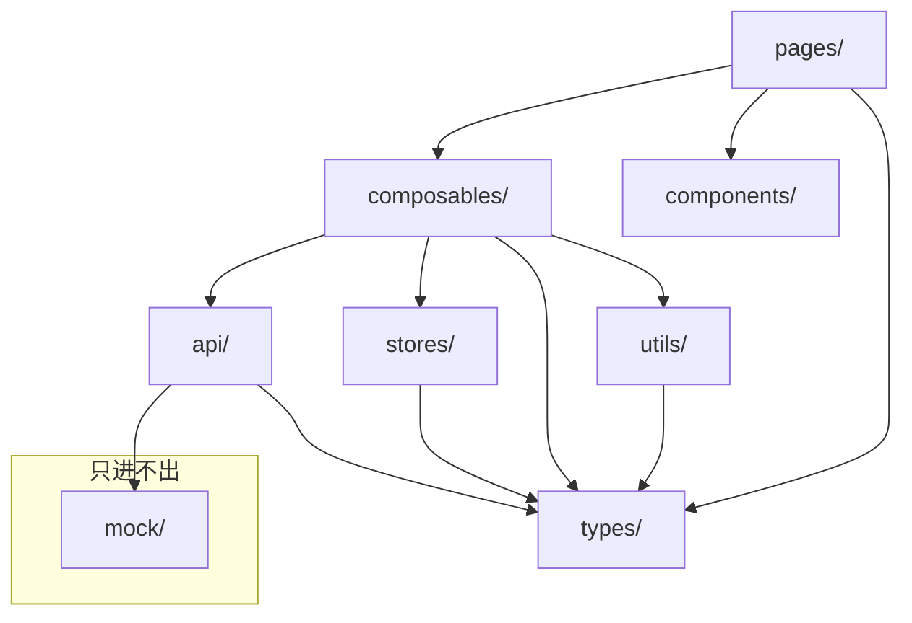
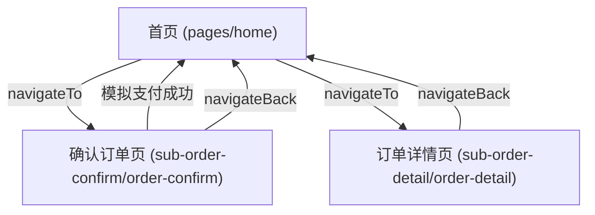

# Architecture Spine — We-Order Phase 1

## Design Paradigm

**Vue 3 Component-Based Architecture**：以页面为编排单元，组件为渲染单元，Composable 为逻辑复用单元。单向数据流，UI 组件不持有业务逻辑。

```
┌───────────────────────────────────────────────┐
│                    PAGE                       │
│  layout → component props/emit orchestration  │
├───────────────────────────────────────────────┤
│                 COMPOSABLE                    │
│  business logic · state management · api call │
├───────────────────────────────────────────────┤
│                    API                        │
│  single data-entry, hides source (mock | ls)  │
└───────────────────────────────────────────────┘
```

## Invariants & Rules

### AD-1 — 数据流方向

- **Binds:** all
- **Prevents:** 组件直接读写数据源、数据路径不一致导致 Phase 3 迁移困难
- **Rule:** 数据流为 `页面 → Composable`。Composable 协调两类数据操作：(a) 外部数据源（Mock JSON、localStorage）的读写必须经由 API 层；(b) 运行时响应式状态（Pinia store）由 Composable 直接读写。API 层负责数据的加载与持久化，不持有运行时状态。

### AD-2 — 模块依赖方向

- **Binds:** all
- **Prevents:** 循环依赖、下层模块引入上层模块导致的架构腐化
- **Rule:** `pages/` → `composables/` → `api/` → (`mock/` | `localStorage`)。`components/` 不依赖 `pages/`、`composables/`、`stores/`。`api/` 不引入任何上层模块。`mock/` 仅被 `api/` 使用。`types/` 可被所有层级引用。`stores/` 仅被 `composables/` 引用。



### AD-3 — 页面与逻辑分离

- **Binds:** all pages
- **Prevents:** 业务逻辑散落在页面文件中，导致单文件膨胀和复用困难
- **Rule:** 页面文件（`pages/`）仅负责组件编排和布局。业务逻辑（数据加载、状态变更、副作用、复杂计算协调）封装在对应的 Composable 中。纯 UI 交互逻辑（弹窗显隐、动画状态、hover/toggle 等不涉及业务判断的 UI 态切换）可保留在组件内部，无需强制抽离。组件通过 props 接收数据，通过 emit 通知页面。

  判断标准：
  - **必须进 Composable**：涉及数据读写、跨组件共享状态、业务规则驱动的操作流程（如"库存为 0 时禁止加购"）
  - **可在组件内**：单个 `ref` 控制的显隐/动画/样式切换，不涉及外部数据源或业务条件判断
  - **拆分时机**：页面同时管理 3 个以上独立逻辑区域的 state 时（如 items、searchQuery、filter、modalVisible 混在同一文件），应考虑按功能拆分为多个 Composable

### AD-4 — 结算栏占位组件加载策略

- **Binds:** shopping-cart, checkout-bar
- **Prevents:** 结算栏在主包中增大首屏体积，或加载时机不明确导致体验不一致
- **Rule:** 结算栏组件位于分包中，使用微信小程序占位组件（`componentPlaceholder`）机制实现按需加载：(a) 页面中声明占位组件，分包未下载时占位组件不渲染任何内容（空节点）；(b) 进入应用时若购物车已有数据，立即触发分包下载，结算栏替换占位组件并从底部滑入；(c) 首次进入且购物车为空时不触发分包下载，占位组件保持空渲染；(d) 首次加购时触发分包下载，结算栏替换占位组件并从底部滑入；(e) 一旦分包下载完成，结算栏永久可见、不销毁。来源 PRD FR-5。

### AD-5 — 组件归属规则

- **Binds:** all components
- **Prevents:** 无实际复用需求的组件被过早提升到全局目录，造成 `components/` 膨胀
- **Rule:** 组件先放在使用它的页面目录下。仅当第二个页面需要复用同一组件时，才将其提升到全局 `components/`。

### AD-6 — Pinia 使用范围

- **Binds:** all stores
- **Prevents:** 所有数据无差别写入 Pinia，状态膨胀且依赖混乱
- **Rule:** Pinia store 仅用于需要跨组件或跨页面共享的响应式状态。页面内数据由 Composable 内的本地响应式变量管理，不放入 Pinia。

### AD-7 — 异常处理规则

- **Binds:** all composables
- **Prevents:** 集中式全局错误处理器导致各场景缺乏灵活性，或异常处理缺失
- **Rule:** 每个 Composable 自行处理其异常场景。数据加载失败由 Composable 返回 error 状态供组件渲染。业务校验失败（如空购物车结算）由 Composable 通过用户可见提示（uni.showToast）阻断操作。Phase 1 不建立全局错误拦截器或统一错误格式。

### AD-8 — Pinia Store 写入口唯一

- **Binds:** all stores
- **Prevents:** 多个 Composable 各自写同一个 Pinia store，导致状态来源不一致、竞争条件
- **Rule:** 每个 Pinia store 只能由一个 Composable 持有写权限。其他需要读取该 store 的 Composable 或组件，通过该 store 的 getter 或 `storeToRefs` 读取，不直接写入。

## Consistency Conventions

| 关注点 | 约定                                                                                                               |
|--------|------------------------------------------------------------------------------------------------------------------|
| 命名（文件、目录、组件） | 统一使用 kebab-case（小写字母 + 短横线），如 `product-card.vue`、`order-confirm/`、`use-products.ts`、`<product-cart />` |
| 组件组织 | 每个组件放在以组件名命名的文件夹下，根组件统一命名为 `index.vue`。如 `checkout-bar/index.vue`、`product-card/index.vue`。子组件、样式、类型、测试文件同目录就近放置 |
| SFC 结构 | 单文件组件的区块顺序固定为 `<script>` → `<template>` → `<style>`                                                              |
| 数据入口 | 参见 AD-1：所有数据读写必须经由 `api/` 层统一入口                                                                                  |
| 状态管理 | 参见 AD-6、AD-8：跨组件共享状态用 Pinia，页面内数据用 Composable 内 `ref()`；每个 Store 由一个 Composable 专责写入                             |
| 类型定义 | 共享业务类型（实体、枚举）定义在 `types/` 中；API 层专用的请求/响应类型定义在 `api/` 文件内；TypeScript strict mode 开启                              |
| Mock 数据 | 通过 Composable 异步加载（模拟网络延迟），不直接静态 import。Mock 数据直接传给组件，不设中间转换层                                                    |
| 价格计算 | 放在 `utils/` 中实现为纯函数，不依赖 Vue 响应式系统。精度问题留待开发时选型合适计算库                                                               |
| 样式 | 使用 TDesign for Uniapp 组件库，基于星巴克设计规范自定义主题。TailwindCSS 先用默认配置，主题定制待定                                               |

## Stack

| 名称 | 版本 |
|------|------|
| Uniapp | — |
| Vue | 3.x |
| TypeScript | strict mode |
| Pinia | — |
| TDesign for Uniapp | — |
| TailwindCSS | — |

## Structural Seed

```
{root}/
├── pages/                     # 主包页面（仅首屏必需）
│   └── home/                  # 首页（点餐 tab + 订单列表 tab）
├── sub-order-confirm/         # 分包：确认订单（按需加载，pages.json subPackages 配置）
│   └── order-confirm/         # 确认订单页
├── sub-order-detail/          # 分包：订单详情（按需加载，pages.json subPackages 配置）
│   └── order-detail/          # 订单详情页
├── sub-components/            # 组件分包（占位组件方式按需加载）
│   └── checkout-bar/          # 结算栏组件
├── components/                # 全局复用组件
├── stores/                    # Pinia 状态（仅跨组件共享的响应式状态）
├── composables/               # 组合式函数（页面逻辑、数据加载）
├── api/                       # 数据访问层（Mock JSON / localStorage 的统一入口）
├── mock/                      # Mock 数据 JSON 文件
├── types/                     # 共享 TypeScript 类型定义
└── utils/                     # 工具函数（纯计算逻辑）
```

### 页面导航结构



## Capability → Architecture Map

| 能力 | 所在位置 | 约束 |
|------|---------|------|
| FR-1 分类导航与商品列表联动 | `pages/home/` + composable | AD-3, AD-1 |
| FR-2 商品卡片展示 | 组件（页面内） + `mock/` | AD-5, 命名约定 |
| FR-3 规格选择与价格计算 | composable + `utils/` | AD-1, 价格计算约定 |
| FR-4 加入购物袋 | composable + Pinia store | AD-1, AD-6, AD-8 |
| FR-5 结算栏占位组件加载 | `sub-components/checkout-bar/` + composable + 占位组件配置 | AD-4 |
| FR-6 购物车抽屉 | 组件（页面内） + composable | AD-5, AD-1, AD-8 |
| FR-7 就餐方式切换 | `sub-order-confirm/order-confirm/` + composable | AD-3, 价格计算约定 |
| FR-8 备注偏好输入 | `sub-order-confirm/order-confirm/` | AD-3 |
| FR-9 确认订单页信息展示 | `sub-order-confirm/order-confirm/` + Pinia store | AD-1, AD-6, AD-8 |
| FR-10 模拟支付 | composable + Pinia store + API 层 | AD-1, AD-7, AD-8 |
| FR-11 订单列表展示 | `pages/home/` 订单 tab + composable | AD-1 |
| FR-12 订单状态 UI | 组件（页面内） + `mock/` | AD-5 |
| FR-13 订单详情页 | `sub-order-detail/order-detail/` + composable | AD-1, AD-3 |
| FR-14 再来一单 | composable + Pinia store | AD-1, AD-6, AD-8 |

## Deferred

| 项目 | 推迟原因 |
|------|---------|
| TailwindCSS 主题定制 | Phase 1 先用默认配置，根据原型还原情况再决定 |
| 价格精度计算库 | 开发时根据需求选择合适库（如 decimal.js），Phase 1 先用原生 JS |
| 全局错误拦截器 | Phase 1 无网络请求，不需要。Phase 3 对接后端时引入 |
| 依赖版本锁定 | Uniapp 生态下版本间兼容性脆弱，未测试不锁版本 |
| 部署与运维 | Phase 1 本地开发运行，无部署需求 |
| 测试策略 | Phase 1 以面试演示验证为主，暂不建立自动化测试 |
