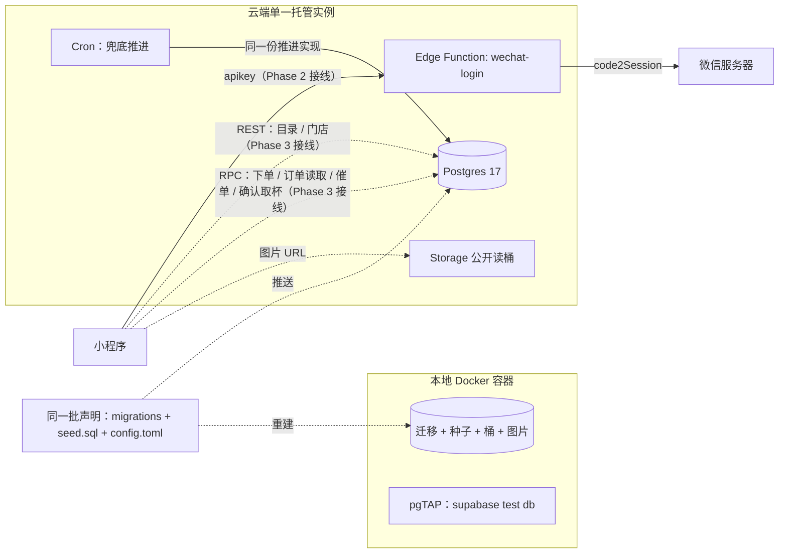
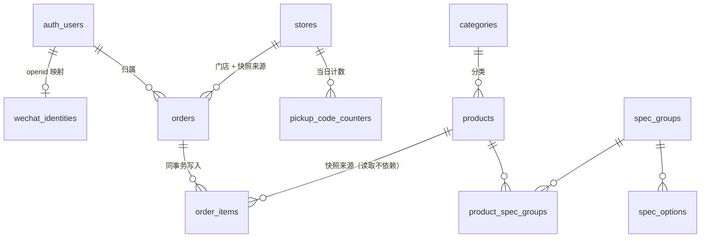

# Architecture Spine — We-Order Phase 2

## Design Paradigm

**数据库权威分层（Fat-DB / Thin-Edge）**：业务规则住在 Postgres——数据访问策略（RLS）定义「谁能看见谁的行」，服务端函数（RPC）承载全部写路径与状态流转，约束与枚举承载不变量；边缘函数只做必须离开数据库的事。

| 层 | 住在哪 | 职责 |
| --- | --- | --- |
| 客户端 | 小程序 `api/` | 会话凭证持有与续期、请求组装；不含业务规则，不承载业务状态 |
| 接口面 | REST（自动生成）+ 服务端函数（RPC） | REST 供无副作用的读；RPC 供全部写与带副作用的读 |
| 规则层 | Postgres：RLS 策略 + 服务端函数 + 约束 | 归属、金额、状态机、取杯号、幂等 |
| 外部集成 | Edge Function（Deno 兼容） | 与微信服务器交互、签发会话 |

落点判定：**读**先问「有没有副作用」——没有走 REST，有走服务端函数；**写**一律服务端函数；**复杂逻辑**拆为「无表访问的纯计算函数」+「承载 I/O 的入口函数」，前者可单独断言。

## Inherited Invariants

| 继承自 | 编号 | 原文要旨 | 在 Phase 2 绑住什么 |
| --- | --- | --- | --- |
| Phase 1 spine | AD-1 数据流方向 | 数据流为 `页面 → Composable`；外部数据源的读写必须经 API 层；API 层不持有运行时状态 | 登录链路的读写必须经 `api/`；页面与组件不得直连后端 |
| Phase 1 spine | AD-2 模块依赖方向 | `pages/ → composables/ → api/`；下层不得引入上层 | 会话代码不得反向依赖 `pages/`、`composables/` |
| Phase 1 spine | AD-3 页面与逻辑分离 | 页面只做编排；业务逻辑在 Composable | 「何时需要登录」不写在页面文件里 |
| Phase 1 spine | AD-7 异常处理规则 | 每个 Composable 自行处理异常；Phase 1 不建全局错误拦截器 | 仍不建全局错误拦截器（全局错误处理属 Phase 3） |
| Phase 1 spine | AD-9 Composable 归属 | composable 先放使用它的包内，按跨目录复用规则提升 | 最小验证入口的 composable 按其归属规则放置 |
| Phase 1 spine | AD-6 / AD-8 Pinia | Pinia 仅用于跨组件/页面共享的响应式状态；每个 store 只由一个 Composable 写入 | 会话不属于业务响应式状态，故不进 Pinia（见 AD-14）；本阶段不新增、不改动 store |
| Phase 1 约定 | 命名与文件组织 | kebab-case、组件目录 `index.vue`、SFC 区块顺序 | 新代码沿用 |

**一处已记录的偏离**：Phase 1 AD-1 含「API 层不持有运行时状态」，而 AD-14 让会话凭证与续期状态住在 `api/` 内——字面上相抵。ly 裁示：Phase 2 对小程序只做一小块改动，**接受此偏离**，Phase 3 正式对接时一并修正。这是**有期限的例外，不是对本条继承约束的重新解释**；见 Deferred。

继承项其余部分为只读约束：本 spine 的任何 AD 不得弱化或改写它们。

## Invariants & Rules

### AD-1 — 三层职责与逻辑落点

- **Binds:** all
- **Prevents:** 逻辑散落三处、鉴权边界出现两份、需要事务的操作被拆到无法回滚
- **Rule:** 无副作用的读走 REST（可见行由 RLS 决定）；一切写与一切带副作用的读走服务端函数；边缘函数只做必须离开数据库的事。复杂逻辑按「无表访问的纯计算函数 + 承载 I/O 的入口函数」拆分，纯计算可单独断言。

### AD-2 — 写路径封闭

- **Binds:** FR-P2-9, FR-P2-10, FR-P2-18
- **Prevents:** 客户端直接插单或改金额，绕过服务端重算；同一笔业务存在两条写路径
- **Rule:** `orders` 与 `order_items` 不存在任何面向客户端的写策略，写权限不授予 `anon`/`authenticated`；订单只能经服务端函数创建。归属取自会话身份，客户端传入的任何用户标识被忽略。不变量：数据库里不存在「金额由客户端决定」的行。

### AD-3 — 归属的表达点

- **Binds:** FR-P2-14, FR-P2-15, FR-P2-18
- **Prevents:** 客户端成为归属的判断点；两处服务端归属谓词各自演进后不再等价
- **Rule:** 归属只在服务端表达，且表达点恰好两处、必须同构：**读**由 RLS 策略表达（`orders` 只允许本人 SELECT）；**RPC 内部**由谓词表达（等价于 `user_id = (select auth.uid())`）。客户端永远不是归属的表达点。两处谓词的等价性由测试钉住（同一身份经 RPC 与经裸表读取，可见行集合必须相同）。确需跨归属执行的机制（如周期推进）单独成函数、自身不含归属谓词，其作用域由调用点决定（见 AD-6）。

### AD-4 — 归属字段只有一处

- **Binds:** 数据模型；FR-P2-14, FR-P2-15
- **Prevents:** 明细与订单各存一份归属，二者不一致时无法判定谁对
- **Rule:** `user_id` 只存在于 `orders`。`order_items` 不携带归属字段，其可见性经所属订单判定。

### AD-5 — 订单读取经服务端函数

- **Binds:** FR-P2-11, FR-P2-14, FR-P2-15
- **Prevents:** REST 读取无法推进状态，出现「已到点却观察到制作中」
- **Rule:** 订单列表与详情经服务端函数读取，函数内先推进调用者到点的订单、再返回结果。`orders` 的本人 SELECT 策略保留作纵深防御，但客户端契约是走函数。**权限模型**：面向用户态写操作的 RPC（下单、催单、确认取杯、订单读取）一律 `SECURITY DEFINER` 并设置 `search_path = ''`，自身按 AD-3 携带归属谓词；这些 RPC 不附带任何额外的表权限，客户端除发布密钥外不获得直接表访问。

### AD-6 — 状态迁移机制与触发策略分离

- **Binds:** FR-P2-11, FR-P2-12, FR-P2-13
- **Prevents:** 并发下重复发号与状态倒退；读时推进与周期兜底各自实现后漂移；Phase 4 更换触发者时重写机制
- **Rule:**
  - **机制**：`orders.status` 的写入只存在于一处实现（推进函数）。合法迁移只有 `cooking→pickup`、`pickup→completed` 两条。**一切对 `orders` 的写都是带状态谓词的原子更新**——包括催单对 `ready_at` 的写入（`... where id = ? and status = 'cooking'`），不得先读后写。
  - **触发**：「何时该推进」（下单后 15 秒、催单提前到 3 秒、Phase 4 的商家点击）来自**同一处配置**，不写死在判断里，可整体替换而不触碰机制。
  - **作用域**：读时推进只作用于**调用者自己**到点的订单；周期兜底作用于**全部**到点订单。两者调用同一实现。
  - **时钟**：一切时间判定使用服务端时钟（数据库 `now()`），客户端时间不参与。催单取「原定时刻」与「催单时刻 + 提前量」的较早者，由服务端计算。
  - **归属**：推进函数不绑定归属，以便 Phase 4 由商家触发；它不向客户端暴露（见 AD-21）。

### AD-7 — 取杯号分配

- **Binds:** FR-P2-11
- **Prevents:** 并发重号；出现「待取餐无号」的脏数据
- **Rule:** 取杯号的唯一域是「门店 + 门店本地自然日」，唯一性由该域上的唯一约束保证。取号与状态迁移由**同一条语句**完成：计数器在尝试推进时递增（`insert ... on conflict do update ... returning`），因此**允许跳号，不允许重号**——跳号只是数字不连续，重号才是事故。不用「查最大值加一」。

### AD-8 — 价格与金额

- **Binds:** FR-P2-6, FR-P2-9
- **Prevents:** 展示价与计价价来自两处；客户端改价成功；浮点误差进入金额
- **Rule:** 价格只有两个定义点——`products.price` 与 `spec_options.price_extra`，二者同时服务展示与重算。订单金额由服务端重算函数依据这两处计算；客户端提交的任何金额被忽略且不落库。加价规则实现为无表访问的纯计算函数。金额列使用定点小数类型（`numeric(10,2)`），精度由数据库类型保证，不依赖客户端计算库。

### AD-9 — 订单快照

- **Binds:** FR-P2-8, FR-P2-9, FR-P2-15
- **Prevents:** 商品改名改价改写历史订单；「再来一单」无法还原原规格
- **Rule:** `order_items` 保存下单时刻的副本：**商品引用**（供「再来一单」定位商品）、商品名、规格选择、规格摘要、单价、数量。订单另存**门店快照**（名称、地址、电话）。订单读取只读副本字段，不 join 目录表取当前值。

### AD-10 — 时间与时区

- **Binds:** FR-P2-9, FR-P2-11, FR-P2-14, FR-P2-15
- **Prevents:** 显示日期与取杯号的「当日」错位；列表与详情时间口径不一致
- **Rule:** 时间以 `timestamptz` 存绝对时刻。门店时区（`stores.timezone`）是唯一时区来源，供「对外格式化」与「取杯号自然日切分」共用。对外输出 `YYYY-MM-DD HH:mm:ss` 文本，格式化只有一个实现，**列表与详情共用同一个**，由服务端完成。

### AD-11 — 幂等

- **Binds:** FR-P2-10
- **Prevents:** 网络重试产生两张订单；跨用户取回他人订单
- **Rule:** 幂等标识由客户端生成且**必填**，是 `orders` 上的列，唯一域为 `(user_id, idempotency_key)`——并发重复提交由该约束兜住，不靠先查后插。同一标识的重复提交返回同一张订单且不重复写入。不另建幂等表。

### AD-12 — 错误类别

- **Binds:** FR-P2-1, FR-P2-5, FR-P2-12, FR-P2-13；NFR 可观测性
- **Prevents:** 三个生产者各自发明错误名；客户端被迫写两套解析
- **Rule:** 错误类别是字符串枚举，定义在数据库类型中并随类型契约生成到客户端；微信错误码到类别的映射只存在于边缘函数；客户端只有一个翻译函数。**类别的取值集合以数据库中的定义为唯一来源，本 spine 不复制一份。** 类别是稳定契约，文案不是。

### AD-13 — 拒绝语义

- **Binds:** FR-P2-12, FR-P2-13, FR-P2-15
- **Prevents:** 通过错误差异探测他人订单是否存在；把幂等重放误判成失败
- **Rule:** 涉及归属的拒绝（非本人 / 不存在）返回同一结果、不可区分。对本人的订单给明确结果，且分两种情况：**目标状态已达成**（重复确认取杯、重复催单）返回成功且不改变任何数据；**目标状态不可达**（对非「制作中」的订单催单）返回明确的状态错误。

### AD-14 — 客户端会话

- **Binds:** Phase 1 AD-1/AD-2/AD-3/AD-6；FR-P2-4
- **Prevents:** token 与续期逻辑散落到各 composable 造成行为不一致；会话进入 Pinia 等于请上层来读它，与「对上层隐形」自相矛盾
- **Rule:** 会话的持有、持久化、过期判断、续期与失败回退全部封在 `api/` 内，对 composable 与页面不可见（判据：上层代码不出现 token 一词，请求头构造也只在 `api/` 内）。`api/` 不向上层暴露「未登录」状态。登录为惰性：需要身份时由 `api/` 保证存在有效会话，启动时不强制登录。会话不进入 Pinia。**续期实现必须单飞**——同一时刻只允许一个续期在飞，其余请求等待并复用其结果。Phase 2 只实现登录一半，此规则约束 Phase 3 的对接实现。

### AD-15 — Phase 2 客户端范围

- **Binds:** FR-P2-1 ~ FR-P2-5；PRD §6 范围护栏
- **Prevents:** 类型契约未定稿前两条数据源并行，形状互相打架
- **Rule:** 小程序侧在 Phase 2 只接登录链路（取一次性凭证 → 换取会话 → 本地持久化）与一个最小验证入口。目录与订单继续读 Mock；不为 Phase 3 预建正式对接层。本 spine 描述的服务端契约是 **Phase 3 的目标态**，不等于 Phase 2 已接线。

### AD-16 — 密钥边界与会话签发

- **Binds:** FR-P2-3, FR-P2-18
- **Prevents:** 服务端密钥进入客户端；密钥放错请求头导致鉴权失败；自签 JWT 在平台密钥轮换后失效
- **Rule:** 客户端只允许出现发布密钥；AppSecret 与平台密钥只存在于服务端运行环境。客户端请求恒带 `apikey: <发布密钥>`，需要身份的请求附 `Authorization: Bearer <访问凭证>`；发布密钥不是 JWT，不得放入 `Authorization`。**会话一律由平台签发，禁止自签 JWT。** 登录边缘函数被调用时尚无会话，须关闭平台的前置 JWT 校验并在函数内自行校验输入、按 AD-12 的类别返回错误。

### AD-17 — 结构与配置声明式入仓

- **Binds:** FR-P2-16
- **Prevents:** 控制台手工结构导致本地与云端漂移；重建不出桶与定时任务
- **Rule:** 全部结构变更以迁移文件存在；桶与图片对象、定时任务同样声明式入仓，不属于「可以手工补」的范围。本地与云端由同一批声明产生，一致性以两边迁移列表一致为证据。任何「只在控制台点过」的结构视为不存在。

### AD-18 — 类型契约

- **Binds:** FR-P2-17
- **Prevents:** 生成物被手工编辑；两份副本长期漂移
- **Rule:** 类型由数据库结构生成，生成物入仓且只有一份，小程序与边缘函数引用同一份，不手工编辑生成物。快照类 JSON 字段标注为需手工类型覆盖，不假装生成类型能给出精确形状。**服务端函数的返回形状属于契约而非实现细节**，由数据库类型定义，见 AD-22。

### AD-19 — 测试基线

- **Binds:** FR-P2-19
- **Prevents:** 测试成为摆设或引入不必要依赖；关键边界只被「演示通过」覆盖
- **Rule:** 测试用 pgTAP，以 `supabase test db` 一条命令运行。模拟身份使用平台当前的 claim 注入方式（历史写法为 `set local role authenticated` 与 `set local request.jwt.claim.sub`，平台已引入 JSON 形式的 claim GUC）——**写法本身不写入契约，以实现时的官方文档为准，契约是测试结果**。不引入第三方 helper。至少覆盖：三类边界（他人数据不可见 / 不可写 / 未认证不可读）、AD-3 的两处归属谓词等价性、金额重算、非法迁移被拒、重复推进幂等、幂等键并发去重。测试必须能在重建后的空库上直接通过。

### AD-20 — 目录与图片只读公开

- **Binds:** FR-P2-6, FR-P2-7, FR-P2-8, FR-P2-18
- **Prevents:** 提前打开目录写路径；图片读取被要求携带身份
- **Rule:** 目录类数据（分类、商品、规格、门店、商品图片）对所有人开放读取，未登录亦可读；目录表不开放任何客户端写策略，写路径留给 Phase 4。商品图片用公开读桶：私有桶的对外读取要么需要签名链接（会过期，而 URL 会进入订单快照与缓存）、要么要求在图片标签上携带请求头（做不到），公开桶的 URL 稳定且直接可用。桶的写操作仍默认拒绝。

### AD-21 — 默认拒绝

- **Binds:** FR-P2-18；all tables
- **Prevents:** 建了策略却忘了启用；无人看管的表（身份映射、取杯号计数器）以默认权限对外暴露
- **Rule:** 每一张表都启用行级访问控制并撤销默认授权，然后按需开策略——**没有策略的表即对客户端完全不可达**，不是「默认可见」。`wechat_identities` 与 `pickup_code_counters` 属于内部表：不携带任何面向客户端的策略，只被服务端函数与服务端密钥触达。验收方式：列出全部表，逐张确认已启用且授权已撤销。

### AD-22 — 共享形状只有一处定义

- **Binds:** FR-P2-9, FR-P2-14, FR-P2-15, FR-P2-17
- **Prevents:** 两个 builder 各自定义同一份共享形状——规格选择的 JSON、订单对外的字段与空值规则、分页信封——各自合规却互不兼容
- **Rule:** 以下共享形状各只有一处定义，且定义在数据库侧（类型或映射函数），不在各调用点重复：
  - **规格选择**：`规格组 id → 选项 id 或选项 id 数组`（数组仅出现在多选组），写入快照与「再来一单」读回使用同一形状。
  - **订单对外形状**：列表与详情的字段名、空值规则（未分配取杯号为空值而非空串）、时间与金额格式完全一致，由同一映射产出。
  - **分页信封**：分页参数的语义与默认值只有一处定义（见 AD-23）。
  - **错误载荷**：错误以 AD-12 的类别值随平台的标准错误载荷返回，不自定义第二套错误信封。

### AD-23 — 有界读取

- **Binds:** FR-P2-14；NFR 性能
- **Prevents:** 无分页的全表扫描随数据增长变慢；翻页过程中重复或遗漏
- **Rule:** 订单列表必须分页，默认每页 20 条，排序为创建时间倒序且稳定；任何列表类读取都不得返回无界结果集。分页参数有上限。

### AD-24 — 身份映射的边界

- **Binds:** FR-P2-2
- **Prevents:** 同一 OpenID 并发首登产生两个用户；映射被复用；采集到不该采集的个人信息
- **Rule:** 身份映射表只做一件事：`openid ↔ 平台用户`。`openid` 上有唯一约束，并发首登由该约束收敛为同一个用户。映射一旦建立不得被另一个 `openid` 复用。除 `openid` 与时间戳（建立时间、最近登录时间）外**不存任何个人信息**——不存昵称、头像、手机号、位置、设备信息。不另建用户表：用户即平台用户。

## Consistency Conventions

| 关注点 | 约定 |
| --- | --- |
| 命名（表、列、函数、枚举值） | 表名小写复数下划线（`order_items`）；函数动词开头（`create_order`、`advance_due_orders`）；枚举值小写下划线（`cooking`） |
| 枚举取值 | 订单状态 `cooking`/`pickup`/`completed`；就餐方式 `dinein`/`takeout`；可售状态三态：下架不出现在目录读取结果中，售罄保留并随结果返回状态（客户端置灰） |
| 规格组 | 全局字典；每个规格组带多选标记，多选组的规格选择值为数组 |
| 订单号 | `SG` + 8 位数字，服务端生成，全局唯一由唯一约束加冲突重试保证 |
| 取杯号 | 字母前缀 + 四位数字（`A-0008`），同一前缀用尽后进入下一个字母（`A-9999 → B-0001`）；未进入「待取餐」时为空值；允许跳号，不允许重号 |
| 时间 | 库存 `timestamptz`；对外 `YYYY-MM-DD HH:mm:ss` 文本（门店时区）；判定一律用服务端时钟 |
| 金额 | 定点小数 `numeric(10,2)`，单位元；外带包装费 2.00、堂食 0 |
| 备注 | 未传或为空一律落库为「无备注要求」 |
| 错误 | 类别是稳定契约，文案不是；提示界面归 Phase 3 |
| 可观测性 | 服务端日志带错误类别与请求标识；登录换取失败、下单被拒、推进异常留记录；日志不得出现 AppSecret 或服务端密钥 |
| 客户端请求 | 恒带 `apikey`；需要身份时附 `Authorization`；请求头构造与错误翻译都只在 `api/` 内 |
| 客户端存储 | 本地存储 key 沿用 `weorder_` 前缀（会话为 `weorder_session`） |
| 迁移与配置 | 结构与配置声明式入仓；注意 `migration squash` 会丢弃 cron 任务与桶，使用它之前须知会丢什么 |

## Stack

| 名称 | 版本 |
| --- | --- |
| Postgres | 17（平台托管；本地容器使用同一大版本） |
| Supabase CLI | 跟随最新（本地容器 / 迁移 / 类型生成 / 部署） |
| 边缘函数运行时 | Deno 兼容（Supabase Edge Runtime，不锁补丁版本） |
| 定时调度 | Supabase Cron（pg_cron，支持 `30 seconds` 级周期） |
| 对象存储 | Supabase Storage |
| 数据库测试框架 | pgTAP（经 `supabase test db`） |
| 客户端 HTTP | 手写 `wx.request`（不引 supabase-js 与社区适配库） |
| 类型生成 | `supabase gen types typescript` |
| 本地容器环境 | Docker（可复现重建与数据库测试的前提） |

## Structural Seed

```text
{仓库根}/
└── supabase/
    ├── config.toml          # 本地栈配置；桶与图片对象的声明（objects_path）
    ├── migrations/          # 全部结构变更：表、策略、函数、桶策略、cron.schedule
    ├── seed.sql             # 目录种子数据（分类、商品、规格、门店）；不含订单
    ├── functions/
    │   └── wechat-login/    # 唯一边缘函数：code2Session → find-or-create → 签发会话
    └── tests/               # pgTAP：三类边界 + 关键函数
```

小程序侧在 Phase 2 的唯一新增（整体结构已在 Phase 1 定案，此处只标新增点）：

```text
api/auth/    # 登录链路 + 会话存取与续期，上层不感知
```

### 环境与拓扑

实线为 Phase 2 真接线的路径，虚线为已定契约、Phase 3 才接线。



### 核心实体



读图要点：用户即平台用户（不另建用户表）；归属字段只在 `orders` 上；商品到明细那条线只是快照来源，读取时不被依赖；`wechat_identities` 与 `pickup_code_counters` 是内部表，无面向客户端的策略。

## Capability → Architecture Map

| 能力 | 所在位置 | 受哪些约束 |
| --- | --- | --- |
| FR-P2-1 ~ FR-P2-5 身份与登录 | 边缘函数 `wechat-login` + `wechat_identities` + 小程序 `api/auth/` | AD-1, AD-12, AD-14, AD-15, AD-16, AD-21, AD-24 |
| FR-P2-6 ~ FR-P2-8 目录只读 | 目录表（REST 公开读）+ Storage 公开读桶 | AD-8, AD-17, AD-20 |
| FR-P2-9 ~ FR-P2-10 下单 | 服务端函数 + `orders` / `order_items` | AD-1, AD-2, AD-3, AD-4, AD-5, AD-8, AD-9, AD-11, AD-22 |
| FR-P2-11 ~ FR-P2-13 状态流转 | 推进函数（读函数与 Cron 共用）+ 原子更新 | AD-5, AD-6, AD-7, AD-10, AD-13, AD-21 |
| FR-P2-14 ~ FR-P2-15 订单查询 | 读函数 + 本人 SELECT 策略 | AD-3, AD-4, AD-5, AD-10, AD-13, AD-22, AD-23 |
| FR-P2-16 ~ FR-P2-19 工程基线 | `migrations/` / `seed.sql` / `config.toml` / `tests/` / 生成类型 | AD-17, AD-18, AD-19 |

## Deferred

| 项目 | 推迟原因 / 再访条件 |
| --- | --- |
| Phase 2 对 Phase 1 AD-1 的已知偏离：会话与续期状态住在 `api/` 内 | ly 裁示接受（Phase 2 只改小程序一小块）；Phase 3 正式对接时一并修正 |
| Phase 4 后台账号体系（店员身份、个人信息、权限） | 另一种主体与另一种登录方式；届时新增表与角色，不改动本阶段结构 |
| 非加法定价的退路（商品↔规格选项上的覆盖价） | 本阶段定价为加法；出现按组合定价时加一列即可 |
| 选项级可售（如「燕麦奶售罄」） | 本阶段只有商品级三态；需要更细粒度时在规格选项上加标记 |
| 本地订单与购物车的去向 | Phase 3 把订单切到服务端时，现有本地存储数据如何处理（清空 / 迁移 / 并存） |
| Realtime 实时推送 | 小程序没有浏览器 WebSocket（有 `wx.connectSocket`），社区 Supabase 适配库已多年未维护；Phase 3 评估，Plan B 为轮询 |
| 客户端编译期类型保护 | 取决于 Phase 3 选定的调用方式 |
| 图片上传与商品写路径 | Phase 4 范围 |
| 域名备案与正式发布链路 | 需备案域名反代或平台云托管中转；不阻塞本阶段 |
| CI/CD、生产部署与多环境治理 | PRD §9 明确排除 |
| 接口版本化与对外兼容承诺 | 接口只服务本项目 |
| 订单取消 / 退款 / 售后 | 状态机只有三态 |
| 会话有效期精调 | 静默登录使过期对用户不可见，平台默认值足够 |
| 平台写法的漂移点 | `verifyOtp` 的校验类型取值、测试中 claim 注入的写法、Postgres 大版本——均随平台演进，实现时以官方文档为准，不写入契约 |
| cron 任务运行历史的清理策略 | 一条清理语句的事；实例长期运行时再加 |
| Phase 3 对接顺序 | 属 Phase 3 规划；影响最小验证入口需要做到什么程度 |
| 并发行为与真机链路的自动化覆盖 | PRD 明确以「实现方式说明 + 人工验证记录」为证据形式 |
