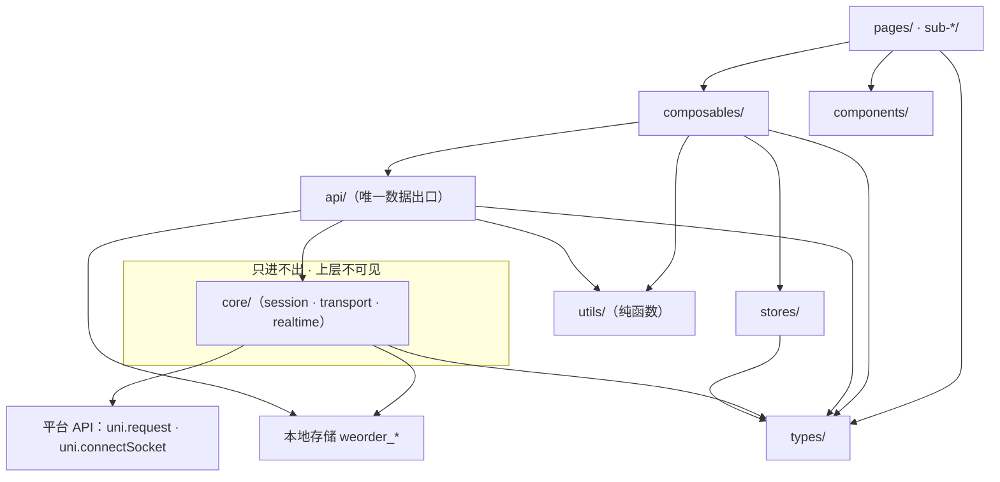
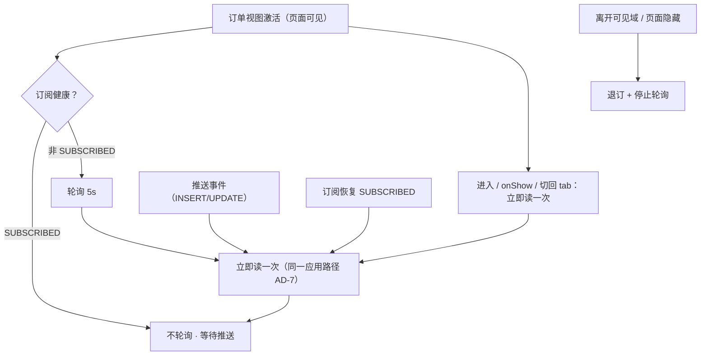
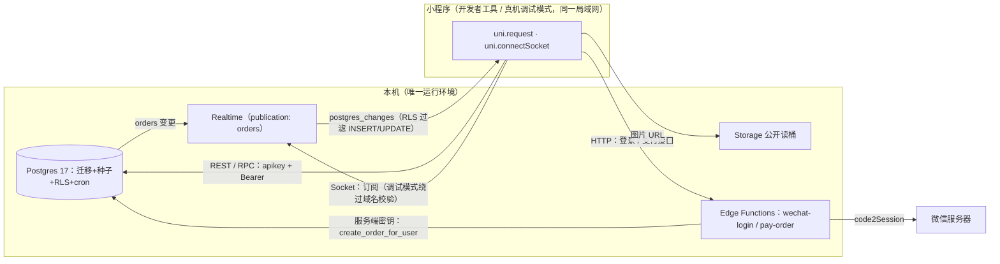
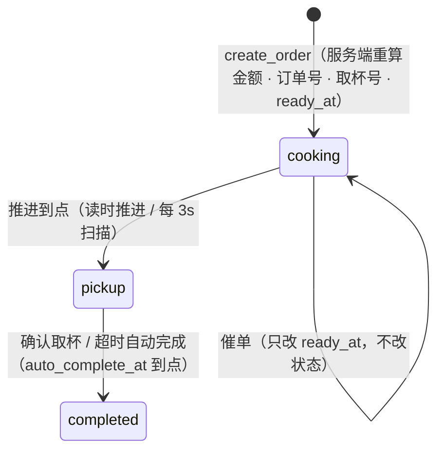

# Architecture Spine — We-Order Phase 3

## Design Paradigm

**薄客户端 · 单一数据通道（Thin Client, Single Data Channel）**：服务端是状态与规则的唯一权威，客户端只做展示与意图提交，不发明状态、不做业务裁决。客户端所有后端访问（REST / RPC / 边缘函数 / Realtime 订阅）只经 `api/` 一个出口；会话、传输、订阅协议沉在 `api/` 之下的 `core/` 基础设施层，对上层不可见。状态的唯一来源是服务端读取；订阅推送只是「变化发生」的触发信号，收到后仍走同一条读取与应用路径，单调、不倒退。

```
┌──────────────────────────────────────────────────────────┐
│ 页面（pages/ · sub-*/）  只编排，不碰数据源                │
├──────────────────────────────────────────────────────────┤
│ Composable              场景决策 · 状态应用 · 页面生命周期  │
├──────────────────────────────────────────────────────────┤
│ api/                    唯一数据出口（HTTP 与订阅都在此）   │
├──────────────────────────────────────────────────────────┤
│ core/                   基础设施，上层不可见                │
│   session（凭证）· transport（请求）· realtime（订阅）      │
├──────────────────────────────────────────────────────────┤
│ 平台 API（uni.request · uni.connectSocket）               │
└──────────────────────────────────────────────────────────┘
```

## Inherited Invariants

两条既有 spine 的约束在本阶段**只读生效**；本 spine 的 AD 不得弱化或改写它们。逐条列出与本期交汇的部分，其余按原文有效（P2 AD-15「Phase 2 客户端范围」的阶段前提已随本阶段消失，不再有效）。继承基线快照：P1 spine `updated 2026-09-09`，P2 spine `updated 2026-09-22`。

| 继承自 | 编号 | 原文要旨 | 在 Phase 3 绑住什么 |
| --- | --- | --- | --- |
| Phase 1 | AD-1 数据流方向 | `页面 → Composable`；外部数据源读写经 API 层；**API 层不持有运行时状态** | 会话迁出 `api/` 后本条恢复；`core/` 只承接基础设施运行时状态（AD-2）；`api/` 不持有订阅句柄、请求序号或会话缓存 |
| Phase 1 | AD-2 模块依赖方向 | `pages/ → composables/ → api/`；下层不得引入上层；`components/` 不依赖 pages/composables/stores；`types/` 全层可引用 | 依赖图扩展一层 `api/ → core/`；`utils/` 引用面见 AD-1（对 P1 的补充，非改写）；`stores/` 仍只被 composables 引用 |
| Phase 1 | AD-3 页面与逻辑分离 | 页面只编排；业务逻辑在 Composable | 刷新编排、订阅启停、错误呈现的决策都留在 Composable |
| Phase 1 | AD-4 结算栏占位组件 | 占位组件按需加载与展开时机，含 (a)–(f) 六个分支 | 数据源替换不得改变加载时机；(a)–(f) 的可观测判据进验证矩阵 #9 |
| Phase 1 | AD-5 / AD-9 归属规则 | 组件先就地后提升；Composable 按复用范围提升；**主包引用的 JS 不得放分包、仅分包使用的 JS 不得放主包目录树** | 新增的订单状态、错误提示逻辑按此放置；根级新增文件必须至少有一个主包调用方 |
| Phase 1 | AD-6 / AD-8 Pinia | 仅跨组件共享的响应式状态；每个 store 单写入口 | 会话不进 Pinia；本阶段不新增 store |
| Phase 1 | AD-7 异常处理规则 | 每个 Composable 自行处理异常；Phase 1 不建全局错误拦截器 | **部分替代**（AD-6/AD-17）：「不建全局拦截器/统一格式」被替代；「加载失败 → error 态供渲染」「业务校验失败 → toast 阻断」继续有效 |
| Phase 1 | Deferred：全局错误拦截器 | Phase 1 无网络请求；Phase 3 对接后端时引入 | 由 AD-6 + AD-17 承接交付 |
| Phase 2 | AD-1 三层职责与逻辑落点 | 读走 REST、写与带副作用的读走 RPC；边缘函数只做必须离开数据库的事 | 支付接口的必要性论证见 AD-11 |
| Phase 2 | AD-2 写路径封闭 | 订单只能经服务端函数创建；归属取自会话身份；客户端用户标识被忽略 | 由 AD-12 收紧：客户端连服务端函数也不可达 |
| Phase 2 | AD-3 / AD-4 归属 | 归属只在服务端表达，表达点恰好两处且同构；`user_id` 只在 `orders` 上 | AD-12 为**显式例外**：新增第三个「声明我是谁」的服务端接缝（只授 `service_role`）；客户端仍不是归属表达点 |
| Phase 2 | AD-5 订单读取经服务端函数 | 读时推进；本人 SELECT 策略保留作纵深防御；用户态 RPC 一律 `SECURITY DEFINER` + `search_path = ''` | 订单读取仍走函数；**订阅为显式例外**（publication + RLS 过滤的变更事件，非行读取，见 AD-9/AD-13）；`SECURITY DEFINER` + `search_path = ''` 纪律由 AD-12 承接 |
| Phase 2 | AD-6 状态迁移机制与触发分离 | 写 `status` 只有一处实现；触发源可替换 | 触发周期调整为 3s（AD-16），机制不动 |
| Phase 2 | AD-7 取杯号 | 下单即分配、恒有值、不可变 | 客户端类型按恒有值处理（AD-14） |
| Phase 2 | AD-8 / AD-10 金额与时间 | 金额服务端重算；时间判定用服务端时钟、对外格式统一 | 客户端展示价仅展示口径；不参与订单金额与时间判定 |
| Phase 2 | AD-9 订单快照 | 明细与门店快照；读取不 join 目录 | 「再来一单」按快照还原（AD-15） |
| Phase 2 | AD-11 幂等 | 幂等键必填；唯一域 `(user_id, idempotency_key)` | 幂等键生命周期由 AD-10 承接 |
| Phase 2 | AD-12 错误类别 | 类别定义在数据库、随类型生成；唯一来源 | 由 AD-6 承接扩展：按端点分派枚举域 + 客户端类别集合 + 域内 `unknown` |
| Phase 2 | AD-13 拒绝语义 | 归属拒绝不可区分；已达成幂等成功、不可达明确报错 | 错误文案与提示遵循此语义（`order_not_found` 不泄露存在性） |
| Phase 2 | AD-14 客户端会话 | 会话对上层隐形、单飞续期、不进 Pinia、key `weorder_session`、请求头构造只在 `api/` 内 | **惰性登录条款被 AD-4 显式修订**；请求头构造判据随 AD-2 迁至 `core/transport`（连带修订）；其余全部继承 |
| Phase 2 | AD-16 密钥边界 | 客户端只持发布密钥；会话由平台签发 | 请求头构造只在 `core/transport`；服务端密钥只在边缘函数环境 |
| Phase 2 | AD-17 结构与配置声明式入仓 | 全部结构变更以迁移文件存在；定时任务同样声明式入仓 | 本期新增迁移（publication、cron 同名替换、包装函数与 ACL）同受此约束 |
| Phase 2 | AD-18 类型契约 | 生成物入仓、只有一份、不手改 | 由 AD-14 承接（跨子项目引用方式见该条） |
| Phase 2 | AD-19 测试基线 | pgTAP 经 `supabase test db`；模拟身份写法不写入契约、契约是测试结果；不加第三方 helper | AD-12 调整调用面（3 个测试文件 62 处 + 8 个 verify 脚本 9 处）；静态权限断言按新授权反转；三类边界覆盖不减少 |
| Phase 2 | AD-20 / AD-21 目录公开读与默认拒绝 | 目录开放读；每张表默认拒绝 | 不改动；publication 只加 `orders`（AD-13）；新函数默认对 PUBLIC 授权，必须显式收回（AD-12） |
| Phase 2 | AD-22 / AD-23 共享形状与有界读取 | 规格选择、订单对外形状、分页信封、错误载荷各只有一处定义；订单列表分页 | 客户端消费这些形状但不另建；分页游标原样回传 |

**已关闭的偏离**：Phase 2 记录的「会话与续期状态住在 `api/` 内」偏离在本阶段关闭——会话移入 `core/session`（AD-2），`api/` 恢复不持有运行时状态。P2 文档侧的偏离段与 Deferred 行删除见「上游回写清单」。

## Invariants & Rules

### AD-1 — 客户端分层与依赖方向

- **Binds:** 全部客户端代码
- **Prevents:** 上层绕道拿会话或连接；数据路径分叉；基础设施代码被页面直接引用；core 内部循环依赖
- **Rule:** 依赖方向固定为 `pages/ · sub-*/ → composables/ → api/ → core/ → 平台 API`。
  - `core/` 只被 `api/` 引用，**任何 api/ 之上的层不得 import core/**；
  - `api/` 不引用上层，且是面向 Composable 的业务数据出口；
  - `components/` 不依赖 pages / composables / stores；`stores/` 只被 composables 引用；
  - `types/` 可被所有层引用（纯类型）；`utils/` 为纯函数，可被 pages / composables / api 引用；**`core/` 不引用 `utils/`**（基础设施只依赖平台与 `types/`）；
  - `core/` 内部：`core/realtime → core/session`（取凭证与本人标识）、`core/session → core/transport`（经裸请求通道调平台 auth 端点）；`core/transport` 不 import `core/session`，取凭证与 401 处理经 `core/session` 装载时注册的 provider 回调完成（避免循环依赖）；
  - Composable 可使用 alova 的 hooks（页面请求状态），但数据访问仍必须经 `api/`。



图只画主要依赖；`types/` 的全层引用不逐一画线。

### AD-2 — `core/` 的职责与运行时状态边界

- **Binds:** AD-1；FR-P3-1/5/6/15
- **Prevents:** 会话状态回流 `api/`（重蹈 Phase 2 偏离）；连接状态散落；页面感知凭证；core 内部互相缠绕
- **Rule:** 运行时状态只允许住在 `core/`（**仅基础设施**：会话/传输/连接）、既有 `stores/`（经 Composable 读写，本阶段不新增）与 Composable 内；`core/` 不承接任何业务响应式状态。三个模块各司其职：
  - `core/session`：会话的唯一读写者——持有、持久化、过期判断、单飞续期、失败回退重登（key `weorder_session`）；依据到期时间**主动安排续期**（不只在请求触发）；对外提供取凭证、取本人标识、`ensureSession()`（等待在飞登录/续期）与凭证变更通知；
  - `core/transport`：alova 实例、**唯一**请求头构造、错误归一、401/`PGRST301`/`not_authenticated` 的续期与重放；另导出「裸请求」通道（不挂续期/重登拦截）供 `core/session` 调平台 auth 端点；
  - `core/realtime`：Realtime 协议客户端、`uni.connectSocket` 传输适配、订阅生命周期、凭证同步。
  `api/` 不持有运行时状态：不放订阅句柄、不放请求序号、不缓存会话，只做「调用 core、映射类型、暴露方法」。

### AD-3 — 唯一数据出口与本地存储出口

- **Binds:** FR-P3-1/3/7/8/10/15；P1 AD-1/AD-2
- **Prevents:** 页面直发请求；Mock 与真实数据并存；本地存储零散读写；两条登录实现
- **Rule:**
  - 所有**业务后端访问**（REST、RPC、边缘函数、Realtime 订阅）都必须经 `api/`；页面与 Composable 不得直接发起网络请求。`core/` 为完成自身职责而发的协议调用（平台 auth 端点、刷新、socket）属基础设施实现细节，不经 `api/`、不向上暴露；
  - **本地存储的唯一出口**：`weorder_session` 只允许 `core/session` 读写；`weorder_cart` 经 `api/cart.ts`；结算意图（`weorder_checkout_intent`）经 `api/orders.ts`；存量清理与版本标记经 `api/storage.ts`（`migrateStorageOnce()`）；**页面与 Composable 不得直接调用 `uni.setStorageSync` / `getStorageSync`**；
  - `api/` 的每个方法声明身份要求：`anonymous`（目录 / 门店 / 图片——**不等待会话**，登录失败不阻塞目录）或 `session-required`（订单 / 支付）；后者先经 `core/session.ensureSession()`，失败统一产出客户端类别 `session_expired`，不让服务端 `not_authenticated`/`42501` 以原始形态上浮；**订阅入口按 AD-9 单独处理**——等待会话、静默回退与补订，不产出用户可见失败。

### AD-4 — 会话纪律（显式修订 P2 AD-14）

- **Binds:** FR-P3-4/5/6；P2 AD-14
- **Prevents:** 启动后长时间无身份导致下单链路不可用；并行续期互相作废；会话状态上浮；清理与读取竞态
- **Rule:**
  - **启动即静默登录**：`App.vue:onLaunch` 经根 Composable `use-app-bootstrap.ts` 触发会话预热，不阻塞页面；失败不弹全局提示（失败在需要身份的动作处暴露，见 AD-17）；
  - **启动时序（gate）**：`onLaunch` 第一步同步执行 `api/storage.ts` 的版本清理；完成前不允许任何存储读取或 store 水合；清理后购物车重新水合（空）；
  - 已有有效会话直接复用，不重复登录；目录浏览不依赖登录；
  - **续期单飞 + 主动续期**：同一时刻只允许一个续期/登录在飞；`core/session` 在凭证到期前主动安排续期，成功后通知订阅方（AD-9）；续期失败回退重新静默登录（带退避与尝试上限，不产生第二个身份、不留下半登录状态）；并发登录产生的可重试 `session_failed` 属自动重试类别；
  - **会合语义**：需要身份的动作（进订单页、点结算等）经 `ensureSession()` 等待在飞登录，不主动失败；只有它失败才暴露（订单页失败态 + 重试 / 结算 toast）；
  - 上层代码不出现 token 一词；**请求头构造只在 `core/transport`**（`core/session` 只提供凭证取值）；不向上层暴露「未登录」；会话不进 Pinia；重登由 `core/session` 自动进行，上层只重试动作；
  - **本条显式取代 P2 AD-14 的「登录为惰性、启动不强制」，并连带修订其「请求头构造只在 `api/` 内」判据**（判据随 AD-2 迁至 `core/transport`）；AD-14 其余条款全部继承，Phase 2 的偏离记录随之关闭。

### AD-5 — 请求库落点（alova）

- **Binds:** FR-P3-1；P2 §6 客户端接入约束
- **Prevents:** 请求库用法散落各层；错误对象或缓存语义泄漏到 Composable；订单/目录读到陈旧数据
- **Rule:** 采用 alova（`alova` + `@alova/adapter-uniapp`），**仅用于传输与页面请求状态**：
  - `createAlova` 实例与全部拦截器只存在于 `core/transport`；**强制点在实例级**：关闭响应缓存与请求共享，方法作者不得依赖默认值或逐方法覆盖；
  - `api/` 定义请求方法并导出；Composable 可用 `useRequest` / `useWatcher` 包裹 `api/` 的方法，但不得用 alova 直接访问后端；
  - 错误经 `core/transport` 归一为 `AppError` 后才可上浮，alova 的错误对象不进入 Composable；
  - 续期与重放由认证拦截器经 `core/session` 注册的 provider 完成，单飞仍归 `core/session`；
  - alova 属通用请求库（PRD §6 允许）。**唯一 SDK 例外**：`@supabase/realtime-js` 只取其 transport 扩展点（AD-9；PRD §6 显式例外）；不引 `supabase-js`，不引社区适配库。

### AD-6 — 错误归一与唯一翻译

- **Binds:** FR-P3-1/18/19；P2 AD-12/AD-22
- **Prevents:** 各调用点各自解析错误；文案与呈现两处演进；未知类别导致白屏；两个枚举域的同名类别互相覆盖
- **Rule:**
  - **承载字段钉死**：RPC 失败 = PostgREST 标准载荷（`P0001` + `message` = 类别值）；边缘函数失败 = 非 2xx + `{ code, message }`（失败响应带 `x-request-id` 头）；平台 auth 端点 = `{ code | error_code, msg | message }`；不新增自定义错误信封；
  - **服务端类别**以生成类型为唯一来源：`order_error_code`（加法新增 `unknown`）与 `login_error_code`；**按端点分派枚举域**，同名类别在不同域可有不同文案；
  - **客户端类别集合**：`network_unreachable`、`timeout`、`request_cancelled`、`session_expired`；
  - **归一表**（唯一实现，落在 `core/transport`）：

    | 来源 | 收到什么 | 归一为 |
    | --- | --- | --- |
    | RPC | `P0001` + message ∈ `order_error_code`（`not_authenticated` 除外，见下行） | `order` 域该类别 |
    | RPC | `P0001` + 未知 message | `order.unknown` |
    | RPC | `42501` | `order.unknown`（权限拒绝不是会话问题，**不触发续期**；与 401 同现时以 SQLSTATE 为准） |
    | `pay-order` | 非 2xx + `{ code }` ∈ `order_error_code` | `order` 域该类别；未知 → `order.unknown` |
    | `wechat-login` | 非 2xx + `{ code }` ∈ `login_error_code` | `login` 域该类别；未知 → `login.unknown` |
    | 平台 auth | `{ error_code \| code }` | `login` 域原样承载，翻译兜底 |
    | 任意 | `PGRST301` / HTTP 401（不含 `42501`） | 不暴露：续期 + 重放一次；恢复失败 → `client.session_expired` |
    | 任意 | `P0001 not_authenticated`（`session-required` 路径） | 续期/重登 + 重放一次；恢复失败 → `client.session_expired` |
    | `uni.request` | fail：timeout / abort / 其他 | `client.timeout` / `client.request_cancelled` / `client.network_unreachable` |

  - **会话类行优先**：401 / `PGRST301` / `not_authenticated` 先走续期与重放，不被类别行短路；`42501` 与 401 同现时以 SQLSTATE 为准。
  - `AppError { code, source: 'login' \| 'order' \| 'client', status?, requestId? }` 的定义放在 `types/`；`requestId` 取自 `x-request-id` 响应头；**类别 → 文案的唯一翻译函数**签名 `(error: AppError) => string`，放在 `utils/error-copy.ts`，按 `source` 选域表、域内用 `Record` 穷尽联合类型（枚举新增时编译报错）；`request_cancelled` 不产生用户可见提示；
  - **分工**：`core/transport` 只归一；Composable 决定呈现形态与重试入口，并保证**同一失败只提示一次**（替代 P1 AD-7 的分散处理；P1 AD-7 其余子句继续有效，见 AD-17）。

### AD-7 — 状态应用单调

- **Binds:** FR-P3-10/11/12/15/19
- **Prevents:** 旧响应覆盖新状态；推送与轮询互相回写；状态倒退；列表被陈旧快照缩水
- **Rule:** 状态的唯一来源是**服务端读取**（列表/详情函数）；推送不是并行数据源：
  - **推送只作触发信号**：收到 INSERT/UPDATE 事件后，编排层合并去重并立即触发一次对应读取；**原始行不进入 UI 状态**（展示字段与时间文本只来自读取结果）；
  - 读取结果按请求序号应用：`seq` 由编排 Composable 在每次读取发出时铸造，比较范围按**订单 id**；`api/` 与 `core/` 不持有或递增任何序号；只应用 `seq` 更大的读取结果；
  - 任何来源都**不接受状态倒退**（`cooking < pickup < completed`，`completed` 为三值状态机的终态）；
  - 重复应用同一状态幂等；
  - **列表合并**：已知 id 更新、未知 id 插入、陈旧读取只合并不删除；整表替换只由首屏读取/显式刷新/分页重置决定；
  - **作用域**：状态按页实例持有、页间不共享；页间一致性由读取（进入可见域/`onShow` 立即读）保证。
  纯逻辑（状态排序、合并、序号判定）放在 `utils/order-status.ts`，进单元测试清单。

### AD-8 — 刷新策略：推送为主，自动回退

- **Binds:** FR-P3-12/15/16；NFR 性能与可靠性
- **Prevents:** 推送与轮询双倍刷新；断线期间状态停滞；恢复订阅后的窗口丢失；页面隐藏后仍耗电请求
- **Rule:** **刷新可见域 = 页面可见 且订单视图激活**（订单列表 tab 或详情页）；切 tab 由页面显式调用编排 Composable 的 `setActive`；离开可见域或页面隐藏即停止轮询并退订。
  - 订阅健康（channel `SUBSCRIBED`）→ **不轮询**，等待推送（推送再触发读取，AD-7）；
  - 订阅不可用（连接中 / 断开 / 重连中）→ **启用轮询，间隔 5s**；
  - **订阅由非 `SUBSCRIBED` 进入 `SUBSCRIBED`（含首次建立）时，先补读一次再停止轮询**（补断线窗口内未重放的变化）；
  - 进入可见域 / 切回订单 tab / App 与页面 `onShow`（且订单视图为当前可见域）→ **立即读一次**，并重置轮询计时；
  - 轮询失败静默重试 3 次；仍失败则停止轮询、降级为手动刷新入口（保留已有数据）；首屏无数据的失败 → 页面失败态；
  - 同一时刻同一视图最多一个轮询计时器，不产生请求堆积；
  - **不设统一开关**：订阅不可用是唯一回退条件；验证纯轮询行为时临时调整代码；
  - **挑战项属性**：本条与 AD-9 属 M2（加分项）；降级时停用 `core/realtime`，本 AD 其余规则不变，轮询为唯一刷新路径。



### AD-9 — 订阅路线、生命周期与凭证同步

- **Binds:** FR-P3-15/16/17；UJ-P3-2；P2 AD-3/AD-5/AD-20
- **Prevents:** 订阅泄露他人数据；连接与凭证脱节；连接风暴；订阅句柄成为第二处状态；真机上不可运行
- **Rule:**
  - **实现路线**（开放问题 6 收敛）：单独使用 `@supabase/realtime-js`（**PRD §6 的显式例外**，仅取 transport 扩展点；版本按 Stack），由 `core/realtime` 注入 `uni.connectSocket` 的 `WebSocketLike` 适配器；不引 `supabase-js` 与社区适配库；
  - **运行时前提（PoC 第一验证点）**：realtime-js 2.117.1 在构造期无条件调用 `new URL()`（`httpEndpointURL`），小程序运行时无 `URL`——`core/realtime` 必须在导入/构造前提供最小 `URL` 垫片（只需 `protocol` / `pathname` / `href` 读写）；PoC 必须**真机冒烟**（开发者工具运行在 NW.js，会掩盖此问题）。其余浏览器全局（`WebSocket` / `window` / `navigator` / `sessionStorage`）库内有 `typeof` 守卫；
  - **所有权**：Composable 决定「何时需要订阅」并持有句柄与决策；`api/` 的订阅入口是**无状态工厂**（不得持有模块级 channel）；`core/realtime` 只做协议、连接、退避与生命周期；订阅/退订必须幂等，同一视图只允许一个活跃 channel（列表与详情互斥）；
  - **入口形状**：`subscribe({ scope: 'list' \| 'order', orderId? }) → { unsubscribe(), onStatus(cb) }`；连接状态经回调上浮（供 AD-8 判定），不上抛异常；
  - 订阅仅在**有有效会话**时建立；会话未就绪时入口等待（不阻塞页面），会话就绪或重登成功后自动补订，期间回退轮询；会话续期/主动续期成功后同步凭证（`setAuth`）；
  - **本人 id 由 `core/session` 提供、经 `api/` 传入 `core/realtime`**，上层不直接持有；filter 不构成归属判定——**RLS 是唯一裁决**；
  - 订阅 `orders` 的 `INSERT` / `UPDATE`（列表 filter `user_id=eq.<本人 id>`，详情 filter `id=eq.<订单 id>`）；不订阅 `DELETE`（Realtime 的 RLS 过滤不适用于 DELETE）与 `order_items`；**非本人变更收不到**由 publication + RLS 保证（AD-13 验收）；
  - 重连退避由协议客户端内置；空闲断连沿用客户端默认（约 2× 心跳）；
  - 订阅失败、回退与恢复过程**对用户静默**；开发期以固定前缀日志输出连接/退订/回退/恢复（可观察手段）。

### AD-10 — 下单幂等键（结算意图）

- **Binds:** FR-P3-8/9；P2 AD-11
- **Prevents:** 超时重试产生第二张订单；购物车变化后复用旧键；杀进程重试丢键；把「结果不明」当明确失败
- **Rule:** 幂等键 = 一次**结算意图**，由客户端生成、必填，跨页面重进与进程重启稳定：

  | 时机 | 动作 |
  | --- | --- |
  | 进入确认订单页 | 无持久化意图、或与当前购物车+就餐方式的**规范化序列化不一致** → 生成并持久化；一致 → 复用 |
  | 购物车内容或就餐方式变化 | 作废重建 |
  | 下单成功；服务端类别（`order_error_code` 全部，含 `not_authenticated`）；`42501`、`session_expired` | 清除（请求未进写路径） |
  | `timeout`、`network_unreachable`、`request_cancelled`（结果不明） | **保留**，重试不换键 |

  - 键随请求经 `pay-order` 请求体原样转发（AD-11）；服务端唯一域 `(user_id, idempotency_key)`；
  - **唯一转换器**：`CartItem[] → CreateOrderItem[]`（wire 形状）只允许在 `api/cart.ts`（`toCreateOrderItems()`）实现，结算与「再来一单」共用；禁止展开购物车条目直传；wire 字段名见 AD-11；
  - 生成、校验与序列化的纯函数放在 `utils/`，进单元测试清单。

### AD-11 — 支付接口（`pay-order`）

- **Binds:** FR-P3-8；UJ-P3-1；P2 AD-1/AD-2/AD-3/AD-16
- **Prevents:** 出现第二套金额计算、归属判定或写路径；客户端在后端尚无支付状态时自造中间态；失败被当成成功；第二份请求/返回形状
- **Rule:** 新增边缘函数 `pay-order`，一次完成「模拟支付 → 创建订单」：
  - **形态**：`POST /functions/v1/pay-order`；`verify_jwt = true`（平台先校验会话，**不关闭校验**）；
  - **请求**：`{ items: [{ product_id, quantity, selections }], dining_mode, notes, idempotency_key }`；`selections` 形状 = 规格组 id → 选项 id（单选）/ 选项 id 数组（多选）；**不含展示字段与任何金额字段**；服务端不接受 camelCase；展示字段不提交；
  - **身份**：用户 id 取自平台已验签 JWT 的 `sub`；用服务端密钥调用 `create_order_for_user`（AD-12；**具名参数必须与 AD-12 签名一致**）——`apikey` 与 `Authorization` **都使用服务端密钥**（角色必须是 `service_role`），客户端 JWT 绝不转发给包装函数调用；不引入客户端可伪造的用户标识参数，不直写订单表；
  - **成功响应**：200，体 = 包装函数返回的订单对外形状（`order_result_json`，与 RPC 返回一致）**原样**，不加信封、不改字段名；语义 = 创建成功才返回支付成功；
  - **失败响应**：**非 2xx**，体 `{ code, message }`，类别复用 `order_error_code`（业务拒绝 4xx、内部故障 5xx），失败响应带 `x-request-id`；客户端以 HTTP 状态判别成功/失败（沿用既有 status-first 语义）；
  - **权限模型**：`pay-order` 是客户端创建订单的唯一入口；不建立支付记录实体与支付状态机；
  - **必要性**：本函数存在的理由是将来真实微信支付的接缝（预下单、客户端二次授权、异步回调必须离开数据库）；本阶段只做模拟支付 + 转发，不引入任何真实支付渠道代码。

### AD-12 — `create_order` 权限收紧

- **Binds:** FR-P3-8；P2 AD-2/AD-3/AD-5/AD-19；架构阶段新增
- **Prevents:** 客户端（含 Postman 等工具）持有效会话绕过支付接口直接建单；用户标识参数成为冒充入口；包装函数经 PUBLIC 默认授权被匿名调用
- **Rule:**
  - `create_order` 的 EXECUTE 从 `public` / `anon` / `authenticated` **收回**，成为只有服务端可达的内核；本体签名与逻辑不变，归属仍只由请求上下文表达；
  - 新增包装函数，**完整签名**：`create_order_for_user(p_user_id uuid, p_items jsonb, p_dining_mode public.dining_mode, p_notes text, p_idempotency_key text) returns jsonb`；`SECURITY DEFINER`、`set search_path = ''`、属主与 `create_order` 相同；`p_user_id` 非空校验；
  - **授权按语句级执行，顺序固定**：先 `revoke execute ... from public, anon, authenticated`（Postgres 的 `create function` 默认授 PUBLIC，仅 grant 不 revoke 遗留匿名入口），**再** `grant execute ... to service_role`；客户端对两个函数均无 EXECUTE；
  - 内部注入：`perform set_config('request.jwt.claims', jsonb_build_object('sub', p_user_id)::text, true)`（**事务局部**），再调用 `create_order`；GUC 名以实现时官方文档为准（Deferred 漂移项）；
  - 这是**唯一允许声明「我是谁」的服务端接缝**，也是 P2 AD-3「归属表达点恰好两处」的**显式例外**（第三个声明点，只授 `service_role`）；客户端直呼任一函数 → `42501`；
  - **失败模式（必须断言）**：注入不生效 → `create_order` 抛 `not_authenticated`（fail-closed，表现伪装成会话失效）——增一条**正向断言**证明注入真的到达 `auth.uid()`；若平台行为不可靠，退路见 Deferred；
  - **调用面调整**：pgTAP 3 个文件 62 处改经 `create_order_for_user`（`service_role`、fixture 提供用户 UUID、移除 claim 注入）；既有静态权限断言反转：`anon`/`authenticated`（含 `public`）对两函数均须为 false，`service_role` 对包装函数为 true（对内核不授权、不作断言）；新增反向断言（`anon`/`authenticated` 直呼两函数 → `42501`）与正向断言（wrapper 建单归属 = `p_user_id`；注入失败 → `not_authenticated`）；8 个 verify 脚本共 9 处 `create_order` 调用改造——优先改走 `pay-order`（保持端到端），确需直呼的用 `service_role` + 包装函数并在脚本头部注明语义变化；
  - PRD FR-P3-17「只增断言、不使既有断言失效」据此修订（见「上游回写清单」）。

### AD-13 — 订阅配套：publication 与验证

- **Binds:** FR-P3-17；P2 AD-5/AD-17/AD-19/AD-21
- **Prevents:** 订阅无数据可收；订阅泄露他人数据；为订阅破坏既有 REST/RPC 行为
- **Rule:**
  - 迁移中把 `public.orders` 加入 `supabase_realtime` publication（**只加这一张表**）；发布决定「什么能进日志流」，RLS 决定「谁能看到哪一行」；publication 不构成授权放开；
  - 验证方式（人工验证记录）：两个身份客户端，A 订阅、B 产生订单变更 → A 收不到任何 `INSERT`/`UPDATE` 事件（含列级数据）；`orders` 的本人 SELECT 策略是订阅前置；
  - **订阅是 P2 AD-5「客户端不直读表」的显式例外**：它消费的是 RLS 过滤后的变更事件，不是行读取；订单读取契约仍是服务端函数；
  - 现有 REST/RPC 行为不受影响；类型契约向后兼容（加法型）；pgTAP 基线保持可运行且通过（调用面调整见 AD-12）。

### AD-14 — 类型契约与客户端唯一契约文件

- **Binds:** FR-P3-2；P2 AD-18/AD-22；ADR-0001
- **Prevents:** 手工类型与生成类型漂移；多份副本；快照 JSON 被假装精确；三个单元各建「看起来一样」的形状
- **Rule:**
  - 唯一生成命令：`supabase gen types typescript --local > supabase/types/database.types.ts`；生成物入仓、不手工编辑；
  - mp 以**相对路径 `import type`** 引用同一份生成物（编译期擦除、不进包）；不复制、不做手工同步步骤；
  - **客户端唯一契约文件 `types/api-contracts.ts`**：`OrderResult`、`OrderListItem`、`OrderDetail`、`OrdersPage`、`CreateOrderItem`、`CreateOrderRequest`、`SpecSelections`，每个标注服务端来源（`order_result_json` / `get_my_orders` / `get_my_order_detail` / `menu` …）；目录、订单、结算、再来一单都从此引用，不得各建一份；用 `satisfies`/穷尽键检查防漂移；
  - **身份映射**：`order.id` = 服务端 UUID（RPC / 订阅 / 列表 key）；`order_number` = 展示编号；同步修改既有 UI（`order-card`、`order-detail`、`use-orders.goToOrderDetail`、`use-reorder`）；
  - **JSON 形态**：金额为 jsonb 数字（元、两位小数）；时间为服务端按门店时区格式化的 `YYYY-MM-DD HH:mm:ss` 文本；快照类 JSON 字段（`selections`、`create_order` 入参、订单读取返回等）保留手工覆盖类型并标注出处；
  - 字段可空性与生成类型一致（如 `pickup_code` 恒有值）；
  - 落点沿用 P1 约定：共享业务类型以生成类型窄别名形式留在 `types/`，`api/` 专属请求/响应类型定义在 `api/` 文件内（`types/api-contracts.ts` 已列出的跨场景 wire 形状除外）；价格纯函数沿用 `utils/`（仅展示口径）。

### AD-15 — 存量清理与单一数据源

- **Binds:** FR-P3-3/11；P2 Deferred
- **Prevents:** Mock 与真实数据并存；旧数据污染真实链路；「加购成功、下单报商品不存在」；清理与读取竞态
- **Rule:**
  - 删除 `src/mock/`、Phase 2 遗留 `api/` 实现（重建）与 `pages/auth-check/` 验证入口；**同步更新 `pages.json` 首页与声明**；不存在任何 Mock 回退开关；
  - **清理是 `onLaunch` 的第一步同步操作**（AD-4 时序 gate），执行者唯一：`api/storage.ts` 的 `migrateStorageOnce()`；版本标记 `weorder_schema_version` 由其写入；
  - 清理集合：`weorder_orders`、`weorder_cart`、`weorder_checkout_intent`（键若曾用于已建单请求，跨版本复用会取回旧订单）→ 版本 ≠ 3 时清空并写 3；`weorder_session` 保留（有效会话直接复用）；清理后购物车 store 重新水合（空）；
  - 「再来一单」只从服务端快照还原，wire 转换复用 AD-10 的唯一转换器；快照中已失效的行丢弃并 toast「部分商品已失效」。

### AD-16 — 演示参数

- **Binds:** FR-P3-13/14；UJ-P3-1
- **Prevents:** 演示节奏不可控；客户端参与时间判定；两个扫描任务并存
- **Rule:** 参数分两类载体，均为服务端/声明式、演示前可调，客户端不参与任何时间判定：
  - **门店行**：推进时长 15s / 催单提前量 3s / 自动完成等待 30s——对新建单与新催单立即生效，已出单的时刻不变；
  - **cron 声明**：扫描周期 3s（由 15s 调小，兑现「催单后 3~6 秒可见待取餐」；订阅健康时，回退轮询下为到点 + ≤5s 轮询）；修改必须**同名替换**（`order-sweep`），不得留下第二个扫描任务；
  - 演示前调整方式：门店行 `UPDATE` 即时生效；cron 周期走迁移或 `cron.alter_job` 后重新确认任务列表。

### AD-17 — 最小 UI 规范与失败不脏状态

- **Binds:** FR-P3-4/7/10/18/19；P1 AD-7（部分替代）；交付物为架构阶段产出
- **Prevents:** 同一失败重复提示；失败伪装成空数据；重复提交；缺图阻塞渲染；在错误处暴露会话状态
- **Rule:**
  - **单一文案来源**：`utils/error-copy.ts`（按 `AppError.source` 分域，AD-6）；场景专属补充（如支付超时提示）由场景的 Composable 追加，不复制翻译；
  - **P1 AD-7 承接**：数据加载失败由 Composable 返回 error 状态供页面失败态渲染；客户端业务校验失败（如空购物车结算）由场景 Composable 以 toast 阻断并保留可重试；
  - **形态分工**：操作级失败用 `uni.showToast({ icon: 'none' })` 且界面停留可重试；页面级加载失败用页面内失败态（文案 + 重试入口）；
  - 订单页加载失败**不展示任何订单数据（含本地缓存）、不以空列表伪装**；空态显示引导且**停止轮询与订阅**；
  - 提交类操作（下单 / 催单 / 确认取杯）进入 loading 防重复态，失败后恢复可点；
  - 缺图以色块占位，不阻塞列表渲染；
  - 启动静默登录失败**不弹全局提示**，在需要身份的动作处暴露（订单页失败态 + 重试；结算失败 toast）；**暴露的是失败类别，不是会话状态**（P2 AD-14 边界）；
  - 关键失败不留脏状态：下单失败保留购物车、不产生重复订单；催单/确认取杯失败不改变本地展示状态。

## 最小 UI 规范

本节是文案与形态的**内容基准**；代码唯一来源是 `utils/error-copy.ts`（文案）与场景 Composable（形态）。同名类别在不同域可有不同文案（按域穷尽，AD-6）。

**登录类**（沿用 Phase 2 文案）：`invalid_app_id` / `invalid_app_secret` → 服务配置异常，请联系管理员；`invalid_code` → 登录凭证无效，请重试；`code_expired_or_used` → 登录凭证已失效，请重试；`invalid_request` → 请求参数异常，请重试；`risky_user_blocked` → 当前账号被限制登录，请稍后重试；`rate_limited` → 操作太频繁，请稍后重试；`wechat_unavailable` → 微信服务暂时不可用，请稍后重试；`identity_failed` / `session_failed` → 登录服务暂时不可用，请稍后重试；`unknown` → 登录失败，请稍后重试。（`network_unreachable` 在枚举中存在但服务端不产生，按客户端类文案处理。）

**订单类（新增）**：

| 类别 | 文案 |
| --- | --- |
| `invalid_request` | 请求有误，请重试 |
| `invalid_quantity` | 商品数量不正确，请调整后重试 |
| `invalid_selection` | 规格选项已变更，请重新选择 |
| `product_unavailable` | 部分商品已售罄或已下架，请调整购物车后重试 |
| `not_authenticated` | 登录状态已失效，请重试 |
| `store_unavailable` | 门店暂时无法下单，请稍后重试 |
| `order_not_found` | 订单不存在或已失效 |
| `invalid_status` | 当前状态不支持该操作，请刷新后重试 |
| `invalid_transition` | 操作无法完成，请刷新后重试 |
| `unknown` | 操作失败，请稍后重试 |

**客户端类**：`network_unreachable` → 网络不可用，请检查网络后重试；`timeout` → 请求超时，请重试；`session_expired` → 登录状态已失效，请重试；`request_cancelled` → 不展示。

**形态表**：

| 场景 | 形态 |
| --- | --- |
| 操作级失败（下单 / 催单 / 确认取杯） | toast（`icon: 'none'`）+ 按钮恢复可点 |
| 页面级加载失败（目录 / 订单列表 / 订单详情） | 页面内失败态：文案 + 「重试」；订单页不展示任何订单数据、不伪装空列表 |
| 提交中 | 按钮 loading + 禁用；支付过程保留 Phase 1 的 loading 与成功反馈 |
| 空态（订单列表） | 「还没有订单」+「去点餐」；停止轮询与订阅 |
| 缺图 | 色块占位；加载失败同占位 |
| 再来一单部分失效 | toast「部分商品已失效」+ 有效条目入购物车 |
| 催单成功 | toast「已通知门店加快制作」 |
| 确认取杯成功 | toast「取杯成功」+ 状态即时更新 |
| 支付超时 | 基础文案 + 结算页内联「可安全重试，不会重复下单」（幂等键保留） |
| 业务拒绝（售罄 / 规格失效 / 商品不可售） | 订单类文案可行动，停留可重试；本阶段不做售罄置灰（见 Deferred） |
| 订单图片（列表卡片 / 详情，Story 4.7） | 卡片只留 编号 / 状态 / 图片行 / 时间 / 金额 / 按钮；图片行单行、每明细行一张（同规格合并、不同规格分行）；溢出用渐变遮罩 + `+N`（N = 未展示行数）；详情每行前置缩略图；缺图色块占位 |

## Consistency Conventions

| 关注点 | 约定 |
| --- | --- |
| 命名（文件、目录、组件） | 沿用 Phase 1：kebab-case；组件目录 `index.vue`；Composable `use-*.ts`；SFC 区块顺序 `<script> → <template> → <style>` |
| 客户端模块 | `core/session`、`core/transport`、`core/realtime`；`api/` 分域：catalog / orders / cart / auth（**仅会话门面**，转调 `core/session`，不得自建登录请求）/ storage；`types/api-contracts.ts` 为客户端唯一契约文件 |
| 本地存储 key | 沿用 `weorder_` 前缀：`weorder_session`（唯一读写者 `core/session`）、`weorder_cart`（`api/cart.ts`）、`weorder_checkout_intent`（`api/orders.ts`）、`weorder_schema_version`（`api/storage.ts`） |
| 错误 | 归一表与文案表见 AD-6 / 最小 UI 规范；类别是稳定契约、文案不是；`AppError.source` 决定域；日志不含密钥、OpenID、堆栈 |
| 请求头 | 恒带 `apikey: <发布密钥>`；需要身份时附 `Authorization: Bearer <访问凭证>`；发布密钥不是 JWT，不得放 `Authorization`；**构造只在 `core/transport`**；调包装函数时 `apikey` 与 `Authorization` 均为服务端密钥 |
| 订阅 | filter 只用 `eq`（`user_id` 或 `id`，由 `api/` 之下构造）；channel 名自由命名、不含凭证；同一视图单活跃 channel；只订 `INSERT`/`UPDATE` |
| 时间与金额 | 客户端不参与判定；展示金额为本地计价（展示口径），订单金额以服务端返回为准；JSON 形态见 AD-14 |
| 幂等 | 生命周期见 AD-10；唯一 `CartItem → CreateOrderItem` 转换器在 `api/cart.ts`；服务端唯一域 `(user_id, idempotency_key)` |
| 演示参数 | 两类载体见 AD-16（门店行 + cron 声明）；cron 修改同名替换；改值后重新确认任务列表再演示 |
| 迁移与配置 | 全部结构变更声明式入仓；新函数必须显式 revoke PUBLIC 再按需 grant；`migration squash` 会丢弃 cron 任务，使用前须知会丢什么 |

## Stack

| 名称 | 版本 |
| --- | --- |
| Uniapp | 3.0.0-5010420260703001（微信小程序目标） |
| Vue | 3.5.x |
| TypeScript | 6.0.x（strict） |
| Pinia | 2.3.1（本阶段不新增 store） |
| TDesign for Uniapp | 0.10.1 |
| TailwindCSS | 4.3.2 |
| alova | 3.5.5 |
| @alova/adapter-uniapp | 2.0.18 |
| @supabase/realtime-js | 2.117.1（仅 transport 扩展点用法；PRD §6 显式例外） |
| Postgres | 17（本地容器） |
| Supabase CLI | 跟随最新（本地栈 / 迁移 / 类型生成 / 部署） |
| 边缘函数运行时 | Deno 兼容（Supabase Edge Runtime） |
| 定时调度 | Supabase Cron（pg_cron，`3 seconds` 周期；同名替换 `order-sweep`） |
| 数据库测试框架 | pgTAP（经 `supabase test db`） |

## Structural Seed

小程序侧（仅列新增与处置；整体结构沿用 Phase 1）：

```text
mp/src/
├── core/                        # 基础设施层（新增；上层不可见）
│   ├── session/                 # 会话唯一读写者；单飞续期 + 主动续期 + 回退重登
│   ├── transport/               # alova 实例、唯一请求头、错误归一、续期重放、裸请求通道
│   └── realtime/                # 协议客户端 + uni.connectSocket 适配 + URL 垫片 + 订阅生命周期
├── api/                         # 唯一数据出口（重建）
│   ├── catalog.ts               # 目录 / 门店（REST，anonymous）
│   ├── orders.ts                # 下单（pay-order）、列表 / 详情 / 催单 / 确认取杯（RPC）、订阅入口、结算意图
│   ├── cart.ts                  # 购物车存储出口 + 唯一 CartItem → CreateOrderItem 转换器
│   ├── auth.ts                  # 会话门面（转调 core/session，不自建登录请求）
│   ├── storage.ts               # migrateStorageOnce()：版本清理唯一执行者
│   └── …                        # 旧 api/auth、verify、orders/products/store 实现整体重写
├── composables/
│   ├── use-app-bootstrap.ts     # 启动编排：清理 gate → 会话预热（App.vue:onLaunch 调用）
│   └── use-order-status.ts      # 订单状态应用与刷新编排（跨主包/分包 → 根）
├── utils/
│   ├── error-copy.ts            # AppError → 文案（唯一翻译函数，按 source 分域）
│   └── order-status.ts          # 状态排序/合并/seq 判定（纯函数）
├── types/
│   ├── api-contracts.ts         # 客户端唯一契约文件（OrderResult / OrderListItem / …）
│   └── …                        # 手工类型退休；错误形状与类别联合
├── pages/ · sub-*/              # 页面结构不变；删除 pages/auth-check/ 并同步 pages.json 首页
├── App.vue                      # onLaunch 调 use-app-bootstrap（清理 → 预热）
└── （删除）src/mock/            # Mock 数据源整体移除
```

后端侧（Phase 3 全部为加法型改动）：

```text
supabase/
├── migrations/                  # 新增：create_order_for_user + revoke/grant 收紧、
│                                #      orders 加入 publication、扫描周期同名替换 3s、
│                                #      order_error_code 追加 unknown、order_items 图片快照列（Story 4.7）
├── functions/
│   ├── wechat-login/            # 不变
│   └── pay-order/               # 新增：verify_jwt = true；服务端密钥调用包装函数；失败带 x-request-id
├── tests/database/              # 既有断言按新授权反转/重述；新增反向与正向断言（AD-12）
├── scripts/                     # verify-*.ts 共 8 文件 9 处 create_order 调用改造（AD-12）
└── types/database.types.ts      # 重新生成
```

### 环境与拓扑

实线为 Phase 3 真实链路；演示环境为本地栈 + 开发者工具或真机调试模式，Phase 4 前不上云。



运行与预检（演示前，addendum §F 为执行清单）：
1. 起本地栈 → 应用迁移与 seed → `functions serve`（`pay-order` 用平台注入的服务端密钥，不落仓）；
2. 结构冒烟：`orders` 在 publication 中、`supabase test db` 全绿、verify 脚本可跑；
3. 参数调整：门店行 `UPDATE` 对新单/新催单立即生效；cron 周期改后确认任务列表只有一个 `order-sweep`；
4. 失败恢复：重建命令（迁移 + seed）可回到可演示状态。

### 订单状态与触发



读图要点：状态写入只有一处实现（Phase 2 AD-6）；触发源为「读时推进」与「周期扫描」两条，Phase 4 商家点击是第三个触发源；状态变化经 Realtime 推送（触发读取）或回退轮询到达客户端；`completed` 为三值状态机终态。

## Capability → Architecture Map

| 能力 | 所在位置 | 受哪些约束 |
| --- | --- | --- |
| FR-P3-1 ~ 3 对接层、类型、清理 | `core/transport`、`api/`、`types/api-contracts.ts`、`api/storage.ts`（清理 gate） | AD-1, AD-3, AD-5, AD-6, AD-14, AD-15 |
| FR-P3-4 ~ 6 静默登录与会话 | 启动编排 `use-app-bootstrap.ts`、`core/session`、`core/transport` | AD-2, AD-3, AD-4 |
| FR-P3-7 目录对接 | `api/catalog.ts` | AD-3, AD-6, AD-17（缺图）；售罄/下架差异化交互推迟（见 Deferred 与回写清单） |
| FR-P3-8 ~ 9 下单与幂等 | `api/orders.ts`、`api/cart.ts`（唯一转换器）、`pay-order`、`create_order_for_user`、`utils/` 幂等键 | AD-10, AD-11, AD-12, AD-17 |
| FR-P3-10 ~ 14 订单查询与流转 | `api/orders.ts`、根 `composables/`、`utils/order-status.ts` | AD-7, AD-8, AD-16, AD-17 |
| FR-P3-11 详情与再来一单 | `api/orders.ts`（快照读取）、`api/cart.ts`（转换器） | AD-10, AD-14, AD-15 |
| FR-P3-15 ~ 17 Realtime 与配套 | `core/realtime`、`api/orders.ts` 订阅入口、根 `composables/`（回退判定与启停）、publication 迁移 | AD-8, AD-9, AD-13 |
| FR-P3-18 ~ 19 错误与用户提示 | `core/transport`、`utils/error-copy.ts`、Composable 场景决策 | AD-6, AD-17 |

## 验证矩阵模板

人工验证记录是唯一的验收证据形式（PRD §6）。每条一行：场景 / 前置 / 步骤 / 期望 / 实际 / 证据 / 结论。

| # | 场景 | 前置 | 期望 |
| --- | --- | --- | --- |
| 1 | 演示主路径（UJ-P3-1） | 本地栈 + 迁移 + seed；开发者工具或真机调试模式 | 静默登录 → 目录 → 加购 → 支付建单 → 催单 → 待取餐 → 已完成 → 详情，全程真实数据、无人工补救；**催单后：订阅健康 3~6s、回退轮询 ≤9s**（到点后 ≤ 一个轮询周期 + 1s） |
| 2 | 登录失败与重试 | 制造登录失败（如错误 AppSecret / 断网） | 可区分文案 + 重试入口；重试不产生半登录状态或孤儿用户；目录仍可浏览 |
| 3 | 续期单飞与主动续期 | 访问凭证到期前并发发起多个请求；另在订单页静置跨过凭证有效期 | 同一时刻只有一个续期在飞；请求等待后全部成功、用户无感；订阅凭证同步、推送不静默失效 |
| 4 | 杀进程后重试 | 支付接口超时/杀进程后重进，购物车未变 | 复用同一幂等键（意图序列化一致）；服务端仍只有一张订单；购物车一致 |
| 5 | 订阅回退与恢复 | 阻断 socket / 停 Realtime，期间产生一次状态变化 | 自动回退 5s 轮询；恢复 `SUBSCRIBED` 时**先补读一次**再停轮询，断线窗口内的变化不丢失；页面行为不降级、无报错打扰 |
| 6 | 归属隔离（含订阅） | 两个身份客户端 | 本人可见本人订单；A 订阅时 B 的变更不产生任何 `INSERT`/`UPDATE` 事件（含列级数据） |
| 7 | 数据库测试基线 | 重建后的空库 | `supabase test db` 全绿；反向断言（anon/authenticated 直呼两函数 → 42501）与正向断言（包装函数注入生效）通过；verify 脚本可跑 |
| 8 | 存量清理后的空启动 | 带 Mock 时代 `weorder_orders`/`weorder_cart`/`weorder_checkout_intent` 的环境 | 升级后旧数据被清空、购物车 store 重新水合（空）；`weorder_session` 有效则直接复用；界面无 Mock 内容 |
| 9 | 界面无回归 | Phase 1 基准；含清理后的首次启动 | 双栏联动、规格计价、购物车、结算、列表/详情/再来一单逐项复验；缺图以占位呈现；**AD-4 专项**：①空购物车启动不触发分包下载、占位空渲染 ②有购物车启动即触发下载并滑入 ③首次加购触发下载 ④未加载时再来一单触发下载并自动展开 |
| 10 | 会话承载可替换（FR-P3-6） | 注入伪会话 | 对接层可独立替换、不携带会话上下文；上层不出现 token |
| 11 | 业务拒绝可区分 | 构造售罄 / 规格失效 / 商品不可售 | 提示类别可区分、文案可行动、停留可重试；不出现白屏或重复提示 |
| 12 | 订阅驱动更新可观察（SM-5） | 详情页可见，服务端推进一次状态 | 本人可观察到一次订阅驱动的更新（日志/录屏为证据）；无需手动刷新 |
| 13 | 自动完成 | 待取餐后不做任何操作 | 门店等待时长（演示参数约 30s）后服务端自动完成，页面在一个轮询周期内感知 |

## Deferred

| 项目 | 推迟原因 / 再访条件 |
| --- | --- |
| 真实微信支付接入 | 本阶段为模拟支付；接入时的绕过防护（支付记录/预下单/异步回调验签）需重新设计——届时 AD-11/AD-12 的权限模型要重评 |
| 售罄与下架的差异化交互 | 后端数据已具备（`product_availability` / `menu` / seed 样例），**P1 客户端从未实现置灰**（Mock 无 availability），原「与 Phase 1 一致」措辞不成立；本阶段 `product_unavailable` 合并文案，差异化交互推迟至 Phase 4，PRD 回写见清单。演示中售罄条目可加购、支付时被拒并给出可行动文案——接受的范围裁剪 |
| 商家后台与 1h 兜底定时器 | Phase 4：商家点击出餐是第三个触发源（P2 已预留）；兜底时长并入门店配置 |
| 多端 / 多客户端订阅 | Phase 4 后台接入后，订阅价值才真正显现（无客户端读取的变更） |
| 订阅半开连接的慢轮询保险 | 默认不做（接受 ≤25–30s 静默窗口）；若演示或真机暴露问题，再加 30–60s 慢轮询 |
| 域名备案与正式发布 | Phase 4 规划公开演示版（面试官真机访问）；正式版 socket 与 request 域名均需备案，策略视 Phase 4 结论 |
| 轮询间隔与扫描周期的最终数值 | 现值 5s / 3s（演示参数）；如需更省电可整体调大，可见性上界随周期定义 |
| 会话有效期精调 | 平台默认 1h + 刷新轮换足够；主动续期使过期对用户不可见 |
| 平台写法漂移点 | `request.jwt.claims` 注入、`auth.uid()` 实现、pg_cron 行为——实现时以官方文档为准；**失败模式**：注入不生效 → `not_authenticated`（伪装成会话失效），AD-12 必须补正向断言；**退路**：改为服务端专用内核 `create_order_internal(p_user_id, …)`（只授 `service_role`，不经 GUC，归属仍只在服务端表达） |
| Realtime 挑战项止损（M2） | PoC 超 1 天（Ly 裁定，与 AI 协同）或演示前未跑通 → 停用 `core/realtime`，纯轮询；AD-7/AD-8 其余规则不变（含 `URL` 垫片与真机冒烟为 PoC 第一验证点） |
| 订单取消 / 退款 / 售后 | 沿袭 P2 非目标；状态机只有三态 |
| P2 文档回写 | 已执行（2026-09-25），见「上游回写记录」 |

## 上游回写记录（2026-09-25 已执行）

下列条目已回写上游文档，各文档修订记录留有对应条目；后续如再变更，按新 `AD` 处理。

| 文档 | 位置 | 改什么 |
| --- | --- | --- |
| PRD `prd.md` | FR-P3-7 | 售罄条款：删去「界面置灰呈现与 Phase 1 一致」（P1 从未实现），改为「售罄商品保留并返回 `availability`；本阶段以统一文案在支付拒绝时呈现，差异化置灰交互属 Phase 4」 |
| PRD `prd.md` | FR-P3-16 | 标题与验收的「统一开关」改为「订阅不可用时自动回退；不设开关（验证纯轮询时临时调整代码）」 |
| PRD `prd.md` | FR-P3-17 | 「只增断言、不使既有断言失效」改为「调用身份调整 + 静态权限断言反转 + 新增反向与正向断言」（AD-12） |
| P2 spine | AD-14 惰性条款 | 指向本 spine AD-4 的显式修订；「请求头构造只在 `api/` 内」判据随 AD-2 迁移 |
| P2 spine | AD-6 / Stack 定时调度行 | 扫描周期 15s→3s（同名替换）；「支持 `30 seconds` 级周期」措辞改为秒级（1–59s） |
| P2 spine | AD-5 | 补订阅显式例外（publication + RLS 过滤的变更事件，非行读取） |
| P2 spine | AD-19 / 测试基线 | 调用面调整（pgTAP 62 处 + verify 脚本 9 处）与静态断言反转 |
| P2 spine | 偏离记录段 + Deferred 偏离行 | 删除/标注关闭（会话已迁 `core/session`） |

## 修订记录

- 2026-09-25：创建（Phase 3 架构运行）。关键裁定：`core/` 基础设施层与会话迁出 `api/`；alova 作为请求库；支付接口 `pay-order` + `create_order` 权限收紧（服务端包装函数）；Realtime 采用 realtime-js transport 扩展点；订阅为主、轮询 5s 自动回退；状态应用单调；扫描周期 15s→3s；最小 UI 规范与验证矩阵模板落地。
- 2026-09-25：评审关口修正（lint 0 findings + rubric 走查 + 输入对账 + 版本核查 + 对抗透镜）。主要修正：推送改为「只作触发信号、收到即补读」；订阅恢复 `SUBSCRIBED` 前补读一次；错误按端点分派枚举域、`AppError` 增 `source`、42501 不再映射会话失效；`create_order_for_user` 完整签名与 revoke/grant 语句序列、注入失败模式与正向断言；幂等键复用条件与清除/保留按类别写死；清理改为 `onLaunch` 第一步 gate 并补 `weorder_checkout_intent`；客户端唯一契约文件与 `order.id`/`order_number` 映射；realtime-js `URL` 垫片与真机冒烟前提；请求头构造统一到 `core/transport`；验证矩阵扩至 13 行；售罄推迟理由按事实改写并入回写清单。
- 2026-09-25：定稿（status: final）。聚焦复核：上轮 14 条发现全部关闭，6 处新引入不一致（会话类行优先级、权限断言角色、契约文件边界、订阅静默语义、催单时效分支等）已修；上游回写已执行（PRD FR-P3-7/16/17 与修订记录；P2 spine AD-2/AD-5/AD-14/AD-19、偏离段、Deferred 行、Stack、修订记录）。
- 2026-09-25：spec 收敛回写（Ly 裁定）：Realtime 止损时间盒由「1–2 周」改为「1 天」；演示定位确认 Phase 3 本地为主、公开演示版归 Phase 4；错误类别 `unknown` 保留（加法型），订阅及其它新增类别暂不入库、先在客户端侧记录。
- 2026-09-26：范围修订（Ly 裁定）：订单页图片化呈现（Story 4.7）——`order_items` 新增图片快照列与读取形状增量（加法型，AR-P3-3 清单已补）；FR-P3-10 / FR-P3-11 展示增量回写 PRD；「最小 UI 规范」形态表补订单图片行；界面结构扩展属对「零变化」约束的显式修订，M1 预演（Story 4.8）覆盖新界面。
