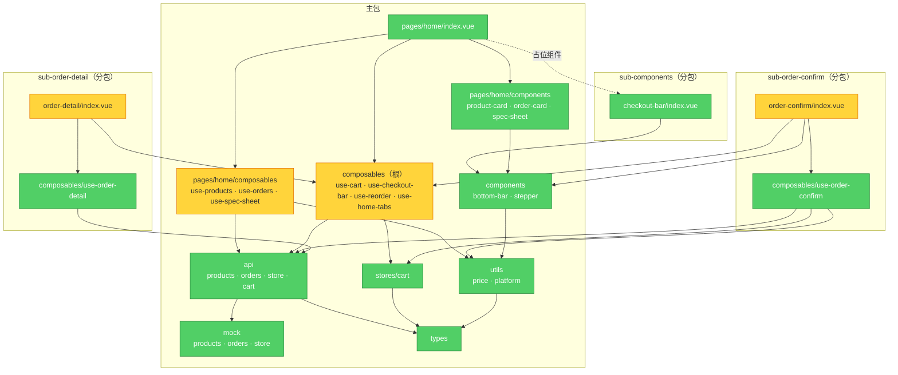

# Brooks-Lint Review

**Mode:** Architecture Audit
**Scope:** mp/src 全部源码（33 个 `.vue/.ts` + 2 个 `.d.ts`），主包 + `sub-order-confirm` / `sub-order-detail` / `sub-components` 三个分包
**Config:** .brooks-lint.yaml applied (strictness: balanced, 0 risks disabled, 0 paths ignored)
**Health Score:** 71/100
**Trend:** First run — no trend data

依赖纪律总体很好：AD-1/AD-2/AD-8 零违规，AD-4 占位组件机制经构建产物验证真实生效；未通过项集中在 composable 归属、错误反馈收口和少量重复表达上，无结构性缺陷。

---

## Module Dependency Graph

## AD 合规总览

| 约定 | 结论 | 说明 |
|------|------|------|
| AD-1 数据流 | ✅ | storage 读写仅出现在 `api/cart`、`api/orders`；页面/组件零直连数据源 |
| AD-2 依赖方向 | ✅ | 无循环、无逆向引用；`components/` 未引用 pages/composables/stores（全量 import 校验） |
| AD-3 页面与逻辑分离 | ✅ | 三个页面均为编排层，业务逻辑集中在 9 个 composable |
| AD-4 占位组件加载 | ✅ | pages.json 声明 + 构建产物验证：`componentPlaceholder: {"checkout-bar":"view"}`、组件落在 sub-components 分包、once-true-never-false 与再来一单展开均按 (a)–(f) 实现 |
| AD-5 组件归属 | ✅ | 全局组件仅 2 个且均多处复用；页面组件留在页面目录（另见 W4 Remedy） |
| AD-6 Pinia 范围 | ⚠️ | cart store 边界正确；checkout-bar 跨页 UI 状态走模块级 ref（S1） |
| AD-7 异常处理 | ⚠️ | 大部分 composable 有 error 状态；两处缺口（W3、S2） |
| AD-8 写入口唯一 | ✅ | cart store 写入方仅 `useCart`；`use-order-confirm` 只读（storeToRefs） |
| AD-9 Composable 归属 | ⚠️ | 页面/分包归属正确；根目录有一处错位（W2），另有一处硬约束例外需补文档（S3） |
| 命名 / SFC 约定 | ✅ | 全量 kebab-case、组件目录 + index.vue、script→template→style 合规 |
| Mock / 工具约定 | ⚠️ | 价格纯函数 ✓；重复表达与文档漂移各一处（W1、S4） |

发现标签：**[Cx]** = 你的架构约定（定义见 `mp/.brooks-lint.yaml`）；**[Rx]** = 通用腐化风险。

---

## Findings

### 🟡 Warning

**W1 [C11] — 价格规则在两处表达**
Symptom: `use-spec-sheet.ts` 的 `unitPrice` computed 自己实现「基础价 + 规格加价」；同样规则在 `utils/price.ts` 的 `calcTotalPrice` 内部又写了一遍。写入购物车的单价来自前者，弹窗总价来自后者。
Source: [Project-defined risk] — C11（价格计算应集中在 utils/）；Fowler — Refactoring: Duplicate Code
Consequence: 计价规则变更（新增折扣、规格加价上限等）需改两处；漏改会让购物车单价与显示总价口径不一致，且错误单价会持久化进 localStorage。
Remedy: 在 `utils/price.ts` 增加 `calcUnitPrice(basePrice, specGroups, selections)`，`use-spec-sheet` 与 `calcTotalPrice` 共用。

**W2 [C9 · AD-9] — use-home-tabs 归属错位**
Symptom: `composables/use-home-tabs.ts` 的 `useHomeTabs()` 仅被 `pages/home/index.vue` 使用；真正跨包复用的只是它导出的 `HOME_TAB_SWITCH_EVENT` 常量（被 `use-reorder`、order-confirm 页引用）。
Source: [Project-defined risk] — C9/AD-9（页面专属 composable 应放 `pages/<page>/composables/`）
Consequence: 根 `composables/` 里混入页面专属实现，「根 = 跨包共享」的归属信号失效，后续维护者难以判断哪些文件真的跨包。
Remedy: 拆分文件——`useHomeTabs` 移入 `pages/home/composables/`；事件常量拆到独立共享模块（如 `composables/events.ts`），三处引用同步更新。

**W3 [C7 · AD-7] — 首页商品加载失败无用户反馈**
Symptom: `use-products.ts` 返回 `error`，但 `pages/home/index.vue` 未解构、未渲染；加载失败时商品区只有空白。对比：订单 tab 有 `ordersError ?? '暂无订单记录'` 兜底，详情页有错误态。
Source: [Project-defined risk] — C7/AD-7（数据加载失败由 Composable 返回 error 状态供组件渲染）
Consequence: 点餐主路径上失败无反馈（Phase 2/3 接入真实网络后概率显著上升）；同类场景处理方式不一致。
Remedy: 参照订单 tab 模式，在商品 scroll-view 内补 error/empty 空态（顺带收敛暴露面，见 S9）。

**W4 [R3] — 订单明细卡片在两个分包页面重复实现**
Symptom: `order-confirm/index.vue` 与 `order-detail/index.vue` 各有一份结构几乎相同的「商品明细卡」——条目行 `unitPrice * quantity`、外带包装费行、合计行，各约 45 行模板；detail 页注释已注明"后续两页需要同时调整时可考虑抽成共享组件"，但尚未行动。
Source: Fowler — Refactoring: Duplicate Code
Consequence: 明细展示规则（新增优惠行、改金额口径）需双改，已经出现细微文案分叉（「共 N 件商品，实付」vs「合计，实付」）。
Remedy: 按 AD-5，第二个页面确已复用 → 提升为共享组件（如 `components/order-items-card/`），两页改为传 props。

### 🟢 Suggestion

**S1 [C6 · AD-6] — checkout-bar 跨页 UI 状态用模块级 ref 而非 Pinia**
Symptom: `use-checkout-bar.ts` 以模块级 `ref` 共享 `checkoutBarVisible`、`cartDetailVisible`（订单详情页"再来一单"要展开首页面板）；一致性约定表写明"跨组件共享状态用 Pinia"。
Source: [Project-defined risk] — C6/AD-6
Consequence: 共享状态所有权不可见（无 store 可查）、无法用 devtools 观察/重置；后续想加交互规则时找不到状态归属。
Remedy: 二选一收口——(a) 迁入 cart store 的 UI 字段，use-checkout-bar 仍为唯一写入口；(b) 在一致性表注明"跨页 UI 瞬态可保留模块级 ref"，把现状合法化。

**S2 [C7 · AD-7] — use-order-confirm.initStore 未捕获异常**
Symptom: `initStore()` 直接 `store.value = await fetchStore()`，无 try/catch、无 error 状态（同目录其他 composable 均有）；另 `startPay` 中 `createOrder()` 未 await，写入失败会被静默吞掉且支付态仍进入成功。
Source: [Project-defined risk] — C7/AD-7
Consequence: Phase 2/3 换真实请求后门店加载失败会抛未处理异常；订单写入失败时用户看到"支付成功"却没有订单记录。
Remedy: `initStore` 捕获并返回 error；`startPay` 内 `await createOrder(...)`，失败时阻断成功态。

**S3 [C9 · AD-9] — 「仅分包使用」的 api/store 无法下沉，建议为硬约束补例外**
Symptom: `api/store.ts`（连同 `mock/store.ts`）只被两个分包的 composable 使用，按 AD-9 硬约束字面本应下沉；但其消费者横跨 sub-order-confirm 与 sub-order-detail——微信规则下分包之间不能互引，只能在主包。
Source: [Project-defined risk] — C9/AD-9 硬约束
Consequence: 约束与微信实际打包规则冲突，未来审计会误判为违规；也可能有人尝试"下沉"造成主包引分包/分包互引的硬错误。
Remedy: 在 AD-9 硬约束补例外："被 2 个及以上分包共享的 JS 必须留在主包，不适用『仅分包使用』约束"。

**S4 [C11 · Seed] — mock 数据是 .ts 模块而非种子所述 JSON 文件**
Symptom: `mock/` 下三个文件均为 `.ts`；Structural Seed 写的是"Mock 数据 JSON 文件"。
Source: [Project-defined risk] — C11 / Structural Seed
Consequence: 文档与实现漂移，按文档找 `*.json` 会扑空；新人无法判断哪种是标准做法。
Remedy: 推荐认可现状（.ts 有类型约束，是更优解），更新 ARCHITECTURE-SPINE 种子说明。

**S5 [R1] — calcTotalPrice 参数过多且含可推导的 flag 参数**
Symptom: `calcTotalPrice(basePrice, specGroups, selections, count, hasSpecs)` 共 5 个参数；`hasSpecs` 可由 `specGroups.length > 0` 推导，调用方也确实这样算出再传入。
Source: Fowler — Refactoring: Long Parameter List / Flag Arguments; McConnell — Code Complete Ch.7
Consequence: 调用方被迫维护一个函数本可自判的状态，是隐性双写；参数表继续增长会降低可读性。
Remedy: 删除 `hasSpecs`，函数内自判；与 W1 的 `calcUnitPrice` 提取一并做。

**S6 [R1] — updateCount(delta) 参数名误导**
Symptom: `use-spec-sheet.ts` 中 `updateCount(delta)` 实际接收步进器的新绝对值（`count.value = delta`），不是增量。
Source: McConnell — Code Complete Ch.11: The Power of Variable Names
Consequence: 读者按"增量"理解后需回读实现纠正——正是命名应当消除的认知成本。
Remedy: 重命名为 `setCount(value)`（事件名 `update-count` 可一并斟酌）。

**S7 [R3] — '无备注要求' 哨兵字符串跨三处耦合**
Symptom: 写入端 `use-order-confirm.ts` 用 `notes.trim() || '无备注要求'` 生成哨兵；读取端 `order-card/index.vue` 用 `notes !== '无备注要求'` 判断；`types/order.ts` 注释里也写死该约定。
Source: Fowler — Refactoring: Primitive Obsession; Hunt & Thomas — DRY
Consequence: 文案改动时读写两端不同步，会把哨兵当真实备注展示。
Remedy: 改用空字符串表示未填写，展示层 `v-if="order.notes"`；或抽 `EMPTY_NOTES` 常量共享。

**S8 [R4] — useCart 每次调用都注册新的持久化 watcher**
Symptom: `use-cart.ts` 的 `watch(items, save, { deep: true })` 位于 `useCart()` 函数体内——每个调用方都会新增一个 watcher 重复执行保存；模块级 `_initialized` 只保护初始化不保护 watcher，且 watcher 生命周期绑定在调用组件上。
Source: Ousterhout — A Philosophy of Software Design（接口应隐藏生命周期副作用）
Consequence: 冗余存储写入；"持久化是否生效"取决于还有没有使用方挂着，未来某个调用方提前卸载时状态可能静默不落盘。
Remedy: watch 移到模块级注册一次（或 app 初始化时用 store 的 `$subscribe` 挂持久化）。

**S9 [R1] — use-products 暴露面大于使用面**
Symptom: `useProducts()` 返回 `loading`、`isProgrammaticScroll`、`computeSectionPositions`，页面均未使用（其中后两者是内部实现细节）。
Source: Ousterhout — A Philosophy of Software Design（信息隐藏 / 深模块接口）
Consequence: 调用方可能依赖内部标记与 DOM 测量函数，把实现细节固化成契约；接口噪声掩盖真正可用的 API。
Remedy: 只返回页面需要的内容，两个内部成员收为局部。

---

## Summary

最值得先做的三件事：**① W1** 提取 `calcUnitPrice` 收口价格规则（消除购物车单价与总价的口径漂移风险）；**② W2** 拆分 `use-home-tabs`，恢复"根 composables = 跨包共享"的归属信号；**③ W3** 给首页商品区补错误空态。整体判断：依赖方向、数据流、store 写入口这三条最容易被破坏的约定守得很干净（AD-2 零违规），剩余问题集中在归属收口与一致性细节，且多处代码注释已显示团队自己意识到了（如 W4），并非失控的腐化。

两个产物已就位：`mp/.brooks-lint.yaml`（AD-1~AD-9 与命名/工具约定固化为 `C1~C11`，本次 YAML 已校验通过）和 `mp/.brooks-lint-history.json`（本分数作为基线，下次复跑会显示趋势）。以后在会话里说「读 `skills/brooks-lint/brooks-audit`，审计 `mp/src`，按 `mp/.brooks-lint.yaml` 配置执行」即可复现；配置的 `disable` / `severity` / `focus` 字段也可以按需调整规则的开关和严格度。
